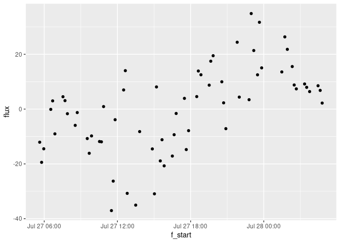

<!-- README.md is generated from README.Rmd. Please edit that file -->

# Fluxible

**Note:** fluxible is still in an early phase, it is fully functional
but can be improved in many ways. Please get in touch for any problems
or suggestions.

<!-- badges: start -->
<!-- badges: end -->

The Fluxible R package is made to transform any dataset of gas
concentration over time into a gas flux dataset. It was originally made
to be used with a closed loop chamber system connected to a gas
analyzer. A function for use with a tent (taking leakage into account)
is in development (see further developments).

The goal of fluxible is to provide a workflow that removes individual
evaluation of each flux, reduces risk of bias, and makes it
reproducible. Users set specific data quality standards and selection
parameters as function arguments that are applied to the entire dataset.
The package runs the calculations automatically, without prompting the
user to take decisions mid-way, and provides quality flags and plots at
the end of the process for a visual check. This makes it easy to use
with large flux datasets and to integrate into a reproducible workflow.
Using the Fluxible R package makes the workflow reproducible, increases
compatibility across studies, and is more time efficient.

For a quick overview of how the package works, you can look at [the
poster](https://github.com/Plant-Functional-Trait-Course/fluxible/blob/main/dissemination/poster_EGU24_jgaudard.pdf)
that was presented at the European Geoscience Union Annual Meeting 2024.

## Installation

You can install the development version of fluxible from the [GitHub
repo](https://github.com/Plant-Functional-Trait-Course/fluxible) with:

``` r
# install.packages("devtools")
devtools::install_github("plant-functional-trait-course/fluxible")
```

## Example

## Practical example

For this exemple we will use the data that were recorded during the
Plant Functional Traits Course 6 (PFTC6) in Norway in 2022 at the site
called Liahovden (CITE when data paper out). The CO<sub>2</sub>
concentration data as well as air and soil temperature and
photosynthetically active radiations (PAR) were recorded in a dataframe
named co2_liahovden. The metadata for each measurements are in a
dataframe called record_liahovden. This dataframe contains the starting
time of each measurements, the type of measurement and the unique ID for
each turf. The type of measurement describes if it was net ecosystem
exchange (NEE), measured with a transparent chamber, or ecosystem
respiration (ER), measured with a dark chamber.

We use the flux_match function to slice the data from co2_liahovden into
each measurement and discard what was recorded in between.

<!-- This is a basic example with some sample data from the Plant Functional Traits Course 6 (2022).
The flux_match function matches field measured gas concentration data with measurements meta data: -->

``` r
library(fluxible)
library(tidyverse)
#> ── Attaching core tidyverse packages ──────────────────────── tidyverse 2.0.0 ──
#> ✔ dplyr     1.1.4     ✔ readr     2.1.5
#> ✔ forcats   1.0.0     ✔ stringr   1.5.1
#> ✔ ggplot2   3.5.1     ✔ tibble    3.2.1
#> ✔ lubridate 1.9.3     ✔ tidyr     1.3.1
#> ✔ purrr     1.0.2     
#> ── Conflicts ────────────────────────────────────────── tidyverse_conflicts() ──
#> ✖ dplyr::filter() masks stats::filter()
#> ✖ dplyr::lag()    masks stats::lag()
#> ℹ Use the conflicted package (<http://conflicted.r-lib.org/>) to force all conflicts to become errors

head(record_liahovden)
#> # A tibble: 6 × 3
#>   turfID     type  start              
#>   <chr>      <chr> <dttm>             
#> 1 4 AN1C 4   NEE   2022-07-27 05:37:30
#> 2 4 AN1C 4   ER    2022-07-27 05:42:00
#> 3 27 AN3C 27 NEE   2022-07-27 05:46:55
#> 4 27 AN3C 27 ER    2022-07-27 05:50:45
#> 5 77 AN2C 77 NEE   2022-07-27 05:57:30
#> 6 77 AN2C 77 ER    2022-07-27 06:02:00
head(co2_liahovden)
#> # A tibble: 6 × 5
#>   datetime            temp_air temp_soil  conc   PAR
#>   <dttm>                 <dbl>     <dbl> <dbl> <dbl>
#> 1 2022-07-27 05:34:49        3      2.96  468.  2.59
#> 2 2022-07-27 05:34:50       NA     NA     469. NA   
#> 3 2022-07-27 05:34:51       NA     NA     468. NA   
#> 4 2022-07-27 05:34:52       NA     NA     468. NA   
#> 5 2022-07-27 05:34:53       NA     NA     468. NA   
#> 6 2022-07-27 05:34:54       NA     NA     468. NA

conc_liahovden <- flux_match(co2_liahovden, record_liahovden)
head(conc_liahovden)
#> # A tibble: 6 × 13
#>   f_datetime          temp_air temp_soil f_conc   PAR turfID   type 
#>   <dttm>                 <dbl>     <dbl>  <dbl> <dbl> <chr>    <chr>
#> 1 2022-07-27 05:37:40       NA        NA   465.    NA 4 AN1C 4 NEE  
#> 2 2022-07-27 05:37:41       NA        NA   465.    NA 4 AN1C 4 NEE  
#> 3 2022-07-27 05:37:42       NA        NA   465.    NA 4 AN1C 4 NEE  
#> 4 2022-07-27 05:37:43       NA        NA   464.    NA 4 AN1C 4 NEE  
#> 5 2022-07-27 05:37:44       NA        NA   464.    NA 4 AN1C 4 NEE  
#> 6 2022-07-27 05:37:45       NA        NA   463.    NA 4 AN1C 4 NEE  
#> # ℹ 6 more variables: f_start <dttm>, f_end <dttm>, f_fluxID <fct>,
#> #   f_n_conc <int>, f_ratio <dbl>, f_flag_match <chr>
```

Before calculating fluxes we need to fit a model to each measurement and
estimate a slope of the concentration changing rate. We use the
flux_fitting function with the model provided by Zhao *et al.* (2018).
The function flux_quality also provides a quadratic and a linear fit.
<!-- Then a model has to be fitted to each flux. -->
<!-- Here we use the model provided by @zhaoCalculationDaytimeCO22018 -->

``` r
slopes_exp_liahovden <- flux_fitting(conc_liahovden, fit_type = "exponential")
#> Cutting measurements...
#> Estimating starting parameters for optimization...
#> Optimizing fitting parameters...
#> Calculating fits and slopes...
#> Done.
#> Warning in flux_fitting_exp(conc_df, start_cut = ((start_cut)), end_cut = ((end_cut)), : 
#>  fluxID 77 : slope was estimated on 194 points out of 210 seconds because data are missing
#>  fluxID 85 : slope was estimated on 175 points out of 210 seconds because data are missing
head(slopes_exp_liahovden)
#> # A tibble: 6 × 30
#>   f_datetime          temp_air temp_soil f_conc   PAR turfID   type 
#>   <dttm>                 <dbl>     <dbl>  <dbl> <dbl> <chr>    <chr>
#> 1 2022-07-27 05:37:40       NA        NA   465.    NA 4 AN1C 4 NEE  
#> 2 2022-07-27 05:37:41       NA        NA   465.    NA 4 AN1C 4 NEE  
#> 3 2022-07-27 05:37:42       NA        NA   465.    NA 4 AN1C 4 NEE  
#> 4 2022-07-27 05:37:43       NA        NA   464.    NA 4 AN1C 4 NEE  
#> 5 2022-07-27 05:37:44       NA        NA   464.    NA 4 AN1C 4 NEE  
#> 6 2022-07-27 05:37:45       NA        NA   463.    NA 4 AN1C 4 NEE  
#> # ℹ 23 more variables: f_start <dttm>, f_end <dttm>, f_fluxID <fct>,
#> #   f_n_conc <int>, f_ratio <dbl>, f_flag_match <chr>, f_time <dbl>,
#> #   f_cut <fct>, n_conc <int>, Cm_est <dbl>, a_est <dbl>, b_est <dbl>,
#> #   tz_est <dbl>, f_Cz <dbl>, time_diff <dbl>, f_Cm <dbl>, f_a <dbl>,
#> #   f_b <dbl>, f_tz <dbl>, f_slope_tz <dbl>, f_fit <dbl>, f_fit_slope <dbl>,
#> #   f_start_z <dttm>
```

The function flux_quality is used to provide diagnostics about the
quality of the fit, eventually advising to discard some measurements or
replace them by zero.
<!-- We run flux_quality to assess the quality of the fits. -->

``` r
slopes_exp_liahovden <- flux_quality(slopes_exp_liahovden, fit_type = "expo", slope_col = "f_slope_tz")
#> 
#>  Total number of measurements: 138
#> 
#>  discard      1   1 %
#>  ok   133     96 %
#>  zero     4   3 %
#>  weird_flux   0   0 %
#>  start_error      0   0 %
#>  no_data      0   0 %
#>  force_ok     0   0 %
head(slopes_exp_liahovden)
#> # A tibble: 6 × 38
#>   f_datetime          temp_air temp_soil f_conc   PAR turfID   type 
#>   <dttm>                 <dbl>     <dbl>  <dbl> <dbl> <chr>    <chr>
#> 1 2022-07-27 05:37:40       NA        NA   465.    NA 4 AN1C 4 NEE  
#> 2 2022-07-27 05:37:41       NA        NA   465.    NA 4 AN1C 4 NEE  
#> 3 2022-07-27 05:37:42       NA        NA   465.    NA 4 AN1C 4 NEE  
#> 4 2022-07-27 05:37:43       NA        NA   464.    NA 4 AN1C 4 NEE  
#> 5 2022-07-27 05:37:44       NA        NA   464.    NA 4 AN1C 4 NEE  
#> 6 2022-07-27 05:37:45       NA        NA   463.    NA 4 AN1C 4 NEE  
#> # ℹ 31 more variables: f_start <dttm>, f_end <dttm>, f_fluxID <fct>,
#> #   f_n_conc <int>, f_ratio <dbl>, f_flag_match <chr>, f_time <dbl>,
#> #   f_cut <fct>, n_conc <int>, Cm_est <dbl>, a_est <dbl>, b_est <dbl>,
#> #   tz_est <dbl>, f_Cz <dbl>, time_diff <dbl>, f_Cm <dbl>, f_a <dbl>,
#> #   f_b <dbl>, f_tz <dbl>, f_slope_tz <dbl>, f_fit <dbl>, f_fit_slope <dbl>,
#> #   f_start_z <dttm>, f_flag_ratio <chr>, f_start_error <chr>,
#> #   f_cor_coef <dbl>, f_RMSE <dbl>, f_fit_quality <chr>, f_correlation <chr>, …
```

The function flux_plot provides plots for a visual assessment of the
measurements, explicitly displaying the quality flags from flux_quality
and the cuts from flux_fitting.
<!-- The plots will also show the modelled slope at t zero. -->

``` r
slopes_exp_liahovden |>
  dplyr::filter(f_fluxID %in% c(54, 95, 100, 101)) |> # we just show a sample of the plots to avoid slowing down the example
    flux_plot(
      fit_type = "exp",
      print_plot = TRUE,
      f_plotname = "example_lia_exp",
      f_ylim_lower = 300,
      f_ylim_upper = 600,
      f_nrow = 2,
      f_ncol = 2,
      y_text_position = 400
      )
#> Plotting in progress
#> Plots saved in f_quality_plots folder.
```


<!-- We might be getting better fits by using only the first part of the measurements. -->

Based on the quality flags and the plots, the user can decide to run
flux_fitting again with different arguments. Here we will do it while
cutting the last 60 seconds of the fluxes (cutting the last third). We
also detected two fluxes (101 and 106) that do not look correct.
Sometimes some measurements will pass the automated quality control but
are obvioulsy wrong for an experience user. That is what the
weird_fluxesID argument is for. For the sake of reproducibility, this
argument should be the last option and be accompagnied with a
justification.

``` r
slopes_exp_liahovden_60 <- conc_liahovden |>
  flux_fitting(fit_type = "exp", end_cut = 60) |>
      flux_quality(fit_type = "exp",
                slope_col = "f_slope_tz",
                weird_fluxesID = c(
                    101, # plot has a high peak at the start. CO2 accumulation in the canopy?
                    106 # peak at the beginning of the flux that is messing up the fit
                    )
                )
#> Cutting measurements...
#> Estimating starting parameters for optimization...
#> Optimizing fitting parameters...
#> Calculating fits and slopes...
#> Done.
#> 
#>  Total number of measurements: 138
#> 
#>  discard      2   1 %
#>  ok   133     96 %
#>  weird_flux   2   1 %
#>  zero     1   1 %
#>  start_error      0   0 %
#>  no_data      0   0 %
#>  force_ok     0   0 %

slopes_exp_liahovden_60 |>
  dplyr::filter(f_fluxID %in% c(54, 95, 100, 101)) |> # we just show a sample of the plots to avoid slowing down the example
    flux_plot(
      fit_type = "exp",
      print_plot = TRUE,
      f_plotname = "example_lia_exp",
      f_ylim_lower = 300,
      f_ylim_upper = 600,
      f_nrow = 2,
      f_ncol = 2,
      y_text_position = 400
      )
#> Plotting in progress
#> Plots saved in f_quality_plots folder.
```


Once we are satisfied with the fit, we can calculate fluxes with
flux_calc. Here the volume is defined as a constant for all the
measurements but it is also possible to provide a specific volume for
each plot in case that is different.

``` r
fluxes_exp_liahovden_60 <- slopes_exp_liahovden_60 |>
  flux_calc(
    slope_col = "f_slope_corr", # we use the slopes provided by flux_quality
    cols_keep = c("f_start", "type"),
    cut_col = "f_cut",
    keep_arg = "keep"
  ) # there is no need to specify the other arguments because the defaults are from our experiment, other users might want to check that
#> Cutting data according to 'keep_arg'...
#> Averaging air temperature for each flux...
#> Creating a dataframe with the columns from 'cols_keep' argument...
#> Calculating fluxes...
head(fluxes_exp_liahovden_60)
#> # A tibble: 6 × 10
#>   f_start             type  f_fluxID f_slope_calc chamber_volume tube_volume
#>   <dttm>              <chr> <fct>           <dbl>          <dbl>       <dbl>
#> 1 2022-07-27 05:37:40 NEE   1           -0.194              24.5       0.075
#> 2 2022-07-27 05:42:10 ER    2            0.0682             24.5       0.075
#> 3 2022-07-27 05:47:05 NEE   3           -0.311              24.5       0.075
#> 4 2022-07-27 05:50:55 ER    4            0.156              24.5       0.075
#> 5 2022-07-27 05:57:40 NEE   5           -0.232              24.5       0.075
#> 6 2022-07-27 06:02:10 ER    6           -0.000145           24.5       0.075
#> # ℹ 4 more variables: atm_pressure <dbl>, temp_air_ave <dbl>,
#> #   volume_setup <dbl>, flux <dbl>
```

The output is in mmol/m<sup>2</sup>/h and the calculation used is as
follow:

<!--  -->

$$
 \text{flux}=\text{slope}\times \frac{P\times V}{R\times T\times A}
$$

where

flux: the flux of gas at the surface of the plot (mmol/m<sup>2</sup>/h)

slope: slope estimate (ppm\*s<sup>-1</sup>)

P: pressure, assumed (atm)

V: volume of the chamber and tubing (L)

R: gas constant (0.082057 L\*atm\*K<sup>-1</sup>\*mol<sup>-1</sup>)

T: chamber air temperature (K)

A: area of chamber frame base (m<sup>2</sup>)

The conversion from micromol/m<sup>2</sup>/s to mmol/m<sup>2</sup>/h is
included in the function.

Fluxes were calculated in five steps from raw gas concentration data and
the process is entirely reproducible. Here is a plot of the results.

``` r
library(ggplot2)
fluxes_exp_liahovden_60 |>
    filter(type == "NEE") |>
        ggplot(aes(f_start, flux)) +
        geom_point()
#> Warning: Removed 3 rows containing missing values or values outside the scale range
#> (`geom_point()`).
```



## Further developments

### Flux tent

Currently fluxible is thought for setups using a flux chamber. Flux
chambers can be assumed to have no leak. As flux tents tend to leak, a
different fitting function is needed to account for potential leaks.

### More fits

As we want fluxible to fit the use of as many projects as possible, more
fitting expressions will be included in the flux_fitting function. Feel
welcome to get in touch if you wish to include yours in fluxible.

## Contact

Joseph Gaudard, University of Bergen, Norway

<joseph.gaudard@pm.me>

[CV](https://jogaudard.github.io/CV_jgaudard/)

## Dissemination

Gaudard, J., Telford, R., Vandvik, V., and Halbritter, A. H.: Fluxible:
an R package to calculate ecosystem gas fluxes in a reproducible and
automated workflow., EGU General Assembly 2024, Vienna, Austria, 14–19
Apr 2024, EGU24-956, <https://doi.org/10.5194/egusphere-egu24-956>,
2024.

[Direct link to the
poster](https://github.com/Plant-Functional-Trait-Course/fluxible/blob/main/dissemination/poster_EGU24_jgaudard.pdf)

<!-- [Link to the abstract](https://meetingorganizer.copernicus.org/EGU24/EGU24-956.html) -->

#### References

<div id="refs" class="references csl-bib-body hanging-indent"
entry-spacing="0" line-spacing="2">

<div id="ref-zhaoCalculationDaytimeCO22018" class="csl-entry">

Zhao, P., Hammerle, A., Zeeman, M. and Wohlfahrt, G. (2018), “[On the
calculation of daytime CO2 fluxes measured by automated closed
transparent chambers](https://doi.org/10.1016/j.agrformet.2018.08.022)”,
*Agricultural and Forest Meteorology*, Vol. 263, pp. 267–275.

</div>

</div>
