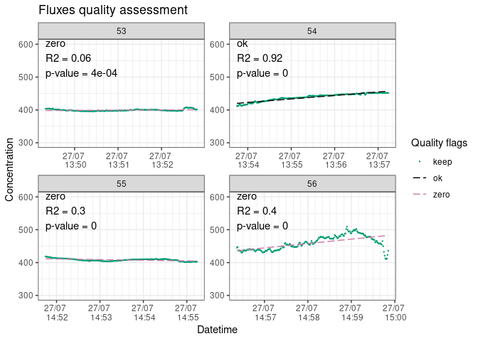
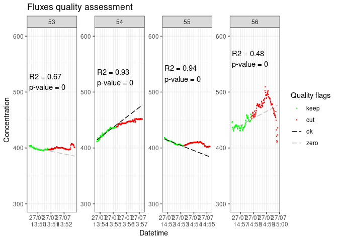
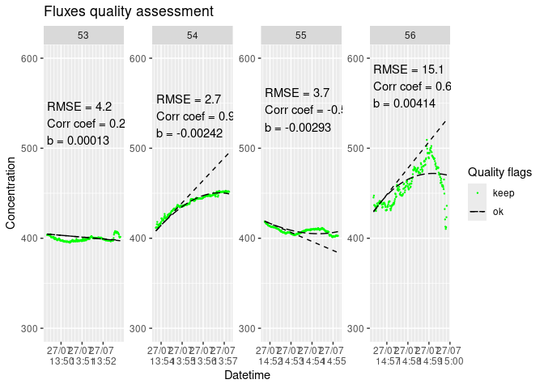
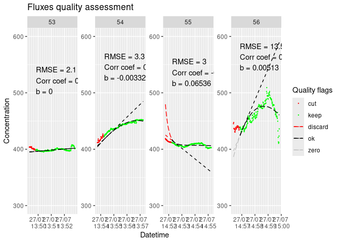

<!-- README.md is generated from README.Rmd. Please edit that file -->

# Fluxible

**Note:** fluxible is still in an early phase, it is fully functional
but can be improved in many ways. Please get in touch for any problems
or suggestions.

<!-- badges: start -->
<!-- badges: end -->

The goal of fluxible is to provide a workflow that removes individual
evaluation of each flux, reduces risk of bias, and makes it
reproducible. Users set specific data quality standards and selection
parameters as function arguments that are applied to the entire dataset.
The package runs the calculations automatically, without prompting the
user to take decisions mid-way, and provides quality flags and plots at
the end of the process for a visual check. This makes it easy to use
with large flux datasets and to integrate into a reproducible workflow.
Using the Fluxible R package makes the workflow reproducible, increases
compatibility across studies, and is more time efficient.

The Fluxible R package is made to transform any dataset of gas
concentration over time into a flux dataset. It was originally made to
be used with a closed loop chamber system connected to a gas analyzer. A
function for use with a tent is in development (see further
developments).

For a quick overview of how the package works, you can look at [the
poster](https://github.com/Plant-Functional-Trait-Course/fluxible/blob/main/dissemination/poster_EGU24_jgaudard.pdf)
that was presented at the European Geoscience Union Annual Meeting 2024.

## Installation

You can install the development version of fluxible from the [GitHub
repo](https://github.com/Plant-Functional-Trait-Course/fluxible) with:

``` r
# install.packages("devtools")
devtools::install_github("plant-functional-trait-course/fluxible")
```

## Example

This is a basic example with some sample data from the Plant Functional
Traits Course 6 (2022). The flux_match function matches field measured
gas concentration data with flux meta data:

``` r
library(fluxible)

conc_liahovden <- flux_match(co2_liahovden, record_liahovden)
head(conc_liahovden)
#> # A tibble: 6 × 13
#>   f_datetime          temp_air temp_soil f_conc   PAR turfID   type 
#>   <dttm>                 <dbl>     <dbl>  <dbl> <dbl> <chr>    <chr>
#> 1 2022-07-27 05:37:40       NA        NA   465.    NA 4 AN1C 4 NEE  
#> 2 2022-07-27 05:37:41       NA        NA   465.    NA 4 AN1C 4 NEE  
#> 3 2022-07-27 05:37:42       NA        NA   465.    NA 4 AN1C 4 NEE  
#> 4 2022-07-27 05:37:43       NA        NA   464.    NA 4 AN1C 4 NEE  
#> 5 2022-07-27 05:37:44       NA        NA   464.    NA 4 AN1C 4 NEE  
#> 6 2022-07-27 05:37:45       NA        NA   463.    NA 4 AN1C 4 NEE  
#> # ℹ 6 more variables: f_start <dttm>, f_end <dttm>, f_fluxID <fct>,
#> #   f_n_conc <int>, f_ratio <dbl>, f_flag_match <chr>
```

To calculate a flux the slopes of each flux is necessary. The
flux_fitting function can provide a linear or an exponential fit. Let’s
start with a linear fit.

``` r
slopes_lin_liahovden <- flux_fitting(conc_liahovden, fit_type = "linear")
#> Warning in flux_fitting_lin(conc_df, start_cut = ((start_cut)), end_cut = ((end_cut)), : 
#>  fluxID 77 : slope was estimated on 194 points out of 210 seconds because data are missing
#>  fluxID 85 : slope was estimated on 175 points out of 210 seconds because data are missing
head(slopes_lin_liahovden)
#> # A tibble: 6 × 22
#>   f_datetime          temp_air temp_soil f_conc   PAR turfID   type 
#>   <dttm>                 <dbl>     <dbl>  <dbl> <dbl> <chr>    <chr>
#> 1 2022-07-27 05:37:40       NA        NA   465.    NA 4 AN1C 4 NEE  
#> 2 2022-07-27 05:37:41       NA        NA   465.    NA 4 AN1C 4 NEE  
#> 3 2022-07-27 05:37:42       NA        NA   465.    NA 4 AN1C 4 NEE  
#> 4 2022-07-27 05:37:43       NA        NA   464.    NA 4 AN1C 4 NEE  
#> 5 2022-07-27 05:37:44       NA        NA   464.    NA 4 AN1C 4 NEE  
#> 6 2022-07-27 05:37:45       NA        NA   463.    NA 4 AN1C 4 NEE  
#> # ℹ 15 more variables: f_start <dttm>, f_end <dttm>, f_fluxID <fct>,
#> #   f_n_conc <int>, f_ratio <dbl>, f_flag_match <chr>, f_time <dbl>,
#> #   f_cut <fct>, n_conc <int>, f_rsquared <dbl>, f_adj_rsquared <dbl>,
#> #   f_pvalue <dbl>, f_intercept <dbl>, f_slope <dbl>, f_fit <dbl>
```

To assess the quality of the fit we use flux_quality. This will add
quality flags advising if the calculated slopes should be kept, or
replaced by 0 or NA.

``` r
slopes_lin_liahovden <- flux_quality(slopes_lin_liahovden, fit_type = "lin")
head(slopes_lin_liahovden)
#> # A tibble: 6 × 25
#>   f_datetime          temp_air temp_soil f_conc   PAR turfID   type 
#>   <dttm>                 <dbl>     <dbl>  <dbl> <dbl> <chr>    <chr>
#> 1 2022-07-27 05:37:40       NA        NA   465.    NA 4 AN1C 4 NEE  
#> 2 2022-07-27 05:37:41       NA        NA   465.    NA 4 AN1C 4 NEE  
#> 3 2022-07-27 05:37:42       NA        NA   465.    NA 4 AN1C 4 NEE  
#> 4 2022-07-27 05:37:43       NA        NA   464.    NA 4 AN1C 4 NEE  
#> 5 2022-07-27 05:37:44       NA        NA   464.    NA 4 AN1C 4 NEE  
#> 6 2022-07-27 05:37:45       NA        NA   463.    NA 4 AN1C 4 NEE  
#> # ℹ 18 more variables: f_start <dttm>, f_end <dttm>, f_fluxID <fct>,
#> #   f_n_conc <int>, f_ratio <dbl>, f_flag_match <chr>, f_time <dbl>,
#> #   f_cut <fct>, n_conc <int>, f_rsquared <dbl>, f_adj_rsquared <dbl>,
#> #   f_pvalue <dbl>, f_intercept <dbl>, f_slope <dbl>, f_fit <dbl>,
#> #   f_start_error <chr>, f_quality_flag <chr>, f_slope_corr <dbl>
```

Users should still do a visual check with the flux_plot function. The
flux_plot function plots all the fluxes with their fluxID, both modelled
and measured concentration, and indicating quality flags with color
codes. Those plots can be printed in the R console, but they will be
saved as a pdf document for easier use. Depending on the plots the user
can re-run flux_fitting with cuts at the start or the end of the
measurements (applied to the entire dataset), change the type of fit, or
decide to exclude specific fluxes using the ‘weird_fluxes’ argument.

``` r
slopes_lin_liahovden |>
  dplyr::filter(f_fluxID %in% c(53:56)) |> # we just show a sample of the plots to avoid slowing down the example
    flux_plot(
      fit_type = "lin",
      print_plot = TRUE,
      f_plotname = "example_lia",
      f_ylim_lower = 300,
      f_ylim_upper = 600,
      f_nrow = 2,
      f_ncol = 2,
      y_text_position = 500
      )
#> [1] "Saving plots in f_quality_plots folder."
```



When using a linear fit, it might be better to use only a short portion
at the start of the flux. We can re run flux_fitting with an end cut,
then run flux_quality and flux_plot again to see if it is better.

``` r
slopes_lin_liahovden_120 <- conc_liahovden |>
  flux_fitting(fit_type = "linear", end_cut = 120) |>
    flux_quality(fit_type = "linear")

slopes_lin_liahovden_120 |>
  dplyr::filter(f_fluxID %in% c(53:56)) |> # we just show a sample of the plots to avoid slowing down the example
    flux_plot(
      fit_type = "lin",
      print_plot = TRUE,
      f_plotname = "example_lia_lin",
      f_ylim_lower = 300,
      f_ylim_upper = 600,
      f_nrow = 2,
      f_ncol = 2,
      y_text_position = 500
      )
#> [1] "Saving plots in f_quality_plots folder."
```



The exponential fit is used in a similar way. It uses the exponential
expression shown in Zhao *et al.* (2018).

``` r
slopes_exp_liahovden <- flux_fitting(conc_liahovden, fit_type = "exponential")
#> Warning in flux_fitting_exp(conc_df, start_cut = ((start_cut)), end_cut = ((end_cut)), : 
#>  fluxID 77 : slope was estimated on 194 points out of 210 seconds because data are missing
#>  fluxID 85 : slope was estimated on 175 points out of 210 seconds because data are missing
head(slopes_exp_liahovden)
#> # A tibble: 6 × 30
#>   f_datetime          temp_air temp_soil f_conc   PAR turfID   type 
#>   <dttm>                 <dbl>     <dbl>  <dbl> <dbl> <chr>    <chr>
#> 1 2022-07-27 05:37:40       NA        NA   465.    NA 4 AN1C 4 NEE  
#> 2 2022-07-27 05:37:41       NA        NA   465.    NA 4 AN1C 4 NEE  
#> 3 2022-07-27 05:37:42       NA        NA   465.    NA 4 AN1C 4 NEE  
#> 4 2022-07-27 05:37:43       NA        NA   464.    NA 4 AN1C 4 NEE  
#> 5 2022-07-27 05:37:44       NA        NA   464.    NA 4 AN1C 4 NEE  
#> 6 2022-07-27 05:37:45       NA        NA   463.    NA 4 AN1C 4 NEE  
#> # ℹ 23 more variables: f_start <dttm>, f_end <dttm>, f_fluxID <fct>,
#> #   f_n_conc <int>, f_ratio <dbl>, f_flag_match <chr>, f_time <dbl>,
#> #   f_cut <fct>, n_conc <int>, Cm_est <dbl>, a_est <dbl>, b_est <dbl>,
#> #   tz_est <dbl>, f_Cz <dbl>, time_diff <dbl>, f_Cm <dbl>, f_a <dbl>,
#> #   f_b <dbl>, f_tz <dbl>, f_slope_tz <dbl>, f_fit <dbl>, f_fit_slope <dbl>,
#> #   f_start_z <dttm>
```

Then the quality assessment. The default slope_col argument is for the
linear fit, so we now have to specify it.

``` r
slopes_exp_liahovden <- flux_quality(slopes_exp_liahovden, fit_type = "expo", slope_col = "f_slope_tz")
head(slopes_exp_liahovden)
#> # A tibble: 6 × 37
#>   f_datetime          temp_air temp_soil f_conc   PAR turfID   type 
#>   <dttm>                 <dbl>     <dbl>  <dbl> <dbl> <chr>    <chr>
#> 1 2022-07-27 05:37:40       NA        NA   465.    NA 4 AN1C 4 NEE  
#> 2 2022-07-27 05:37:41       NA        NA   465.    NA 4 AN1C 4 NEE  
#> 3 2022-07-27 05:37:42       NA        NA   465.    NA 4 AN1C 4 NEE  
#> 4 2022-07-27 05:37:43       NA        NA   464.    NA 4 AN1C 4 NEE  
#> 5 2022-07-27 05:37:44       NA        NA   464.    NA 4 AN1C 4 NEE  
#> 6 2022-07-27 05:37:45       NA        NA   463.    NA 4 AN1C 4 NEE  
#> # ℹ 30 more variables: f_start <dttm>, f_end <dttm>, f_fluxID <fct>,
#> #   f_n_conc <int>, f_ratio <dbl>, f_flag_match <chr>, f_time <dbl>,
#> #   f_cut <fct>, n_conc <int>, Cm_est <dbl>, a_est <dbl>, b_est <dbl>,
#> #   tz_est <dbl>, f_Cz <dbl>, time_diff <dbl>, f_Cm <dbl>, f_a <dbl>,
#> #   f_b <dbl>, f_tz <dbl>, f_slope_tz <dbl>, f_fit <dbl>, f_fit_slope <dbl>,
#> #   f_start_z <dttm>, f_cor_coef <dbl>, f_RMSE <dbl>, f_start_error <chr>,
#> #   f_fit_quality <chr>, f_correlation <chr>, f_quality_flag <chr>, …
```

The plots will also show the modelled slope at t zero.

``` r
slopes_exp_liahovden |>
  dplyr::filter(f_fluxID %in% c(53:56)) |> # we just show a sample of the plots to avoid slowing down the example
    flux_plot(
      fit_type = "exp",
      print_plot = TRUE,
      f_plotname = "example_lia_exp",
      f_ylim_lower = 300,
      f_ylim_upper = 600,
      f_nrow = 2,
      f_ncol = 2,
      y_text_position = 500
      )
#> [1] "Saving plots in f_quality_plots folder."
```



Again, we can try to cut it if needed.

``` r
slopes_exp_liahovden_30 <- conc_liahovden |>
  flux_fitting(fit_type = "exp", start_cut = 30) |>
    flux_quality(fit_type = "exp", slope_col = "f_slope_tz")
#> Warning in flux_fitting_exp(conc_df, start_cut = ((start_cut)), end_cut = ((end_cut)), : 
#>  fluxID 77 : slope was estimated on 164 points out of 180 seconds because data are missing
#>  fluxID 85 : slope was estimated on 145 points out of 180 seconds because data are missing

slopes_exp_liahovden_30 |>
  dplyr::filter(f_fluxID %in% c(53:56)) |> # we just show a sample of the plots to avoid slowing down the example
    flux_plot(
      fit_type = "exp",
      print_plot = TRUE,
      f_plotname = "example_lia_lin",
      f_ylim_lower = 300,
      f_ylim_upper = 600,
      f_nrow = 2,
      f_ncol = 2,
      y_text_position = 500
      )
#> [1] "Saving plots in f_quality_plots folder."
```



Once we are satisfied with the fit, we can calculate fluxes with
flux_calc.

``` r
fluxes_exp_liahovden <- slopes_exp_liahovden |>
  flux_calc(
    slope_col = "f_slope_corr", # we use the slopes provided by flux_quality
    cols_keep = "f_start"
  ) # there is no need to specify the other arguments because the defaults are from our experiment, other users might want to check that
head(fluxes_exp_liahovden)
#> # A tibble: 6 × 5
#>   f_start             f_fluxID f_slope_calc temp_air_ave    flux
#>   <dttm>              <fct>           <dbl>        <dbl>   <dbl>
#> 1 2022-07-27 05:37:40 1            -0.156           3.27  -9.76 
#> 2 2022-07-27 05:42:10 2             0.146           3.31   9.10 
#> 3 2022-07-27 05:47:05 3            -0.227           3.15 -14.2  
#> 4 2022-07-27 05:50:55 4             0.143           2.98   8.93 
#> 5 2022-07-27 05:57:40 5            -0.139           2.86  -8.67 
#> 6 2022-07-27 06:02:10 6            -0.00487         2.91  -0.304
```

The output is in mmol/m<sup>2</sup>/h and the calculation used is as
follow:

<!--  -->

$$
 \text{flux}=\text{slope}\times \frac{P\times V}{R\times T\times A}
$$

where

flux: the flux of gas at the surface of the plot (mmol/m<sup>2</sup>/h)

slope: slope estimate (ppm\*s<sup>-1</sup>)

P: pressure, assumed (atm)

V: volume of the chamber and tubing (L)

R: gas constant (0.082057 L\*atm\*K<sup>-1</sup>\*mol<sup>-1</sup>)

T: chamber air temperature (K)

A: area of chamber frame base (m<sup>2</sup>)

The conversion from micromol/m<sup>2</sup>/s to mmol/m<sup>2</sup>/h is
included in the function.

## Further developments

### Flux tent

Currently fluxible is thought for setups using a flux chamber. Flux
chambers can be assumed to have no leak. As flux tents tend to leak, a
different fitting function is needed to account for potential leaks.

### More fits

As we want fluxible to fit the use of as many projects as possible, more
fitting expressions will be included in the flux_fitting function. Feel
welcome to get in touch if you wish to include yours in fluxible.

## Contact

Joseph Gaudard, University of Bergen, Norway

<joseph.gaudard@pm.me>

[CV](https://jogaudard.github.io/CV_jgaudard/)

## Dissemination

Gaudard, J., Telford, R., Vandvik, V., and Halbritter, A. H.: Fluxible:
an R package to calculate ecosystem gas fluxes in a reproducible and
automated workflow., EGU General Assembly 2024, Vienna, Austria, 14–19
Apr 2024, EGU24-956, <https://doi.org/10.5194/egusphere-egu24-956>,
2024.

[Direct link to the
poster](https://github.com/Plant-Functional-Trait-Course/fluxible/blob/main/dissemination/poster_EGU24_jgaudard.pdf)

<!-- [Link to the abstract](https://meetingorganizer.copernicus.org/EGU24/EGU24-956.html) -->

#### References

<div id="refs" class="references csl-bib-body hanging-indent"
entry-spacing="0" line-spacing="2">

<div id="ref-zhaoCalculationDaytimeCO22018" class="csl-entry">

Zhao, P., Hammerle, A., Zeeman, M. and Wohlfahrt, G. (2018), “[On the
calculation of daytime CO2 fluxes measured by automated closed
transparent chambers](https://doi.org/10.1016/j.agrformet.2018.08.022)”,
*Agricultural and Forest Meteorology*, Vol. 263, pp. 267–275.

</div>

</div>
