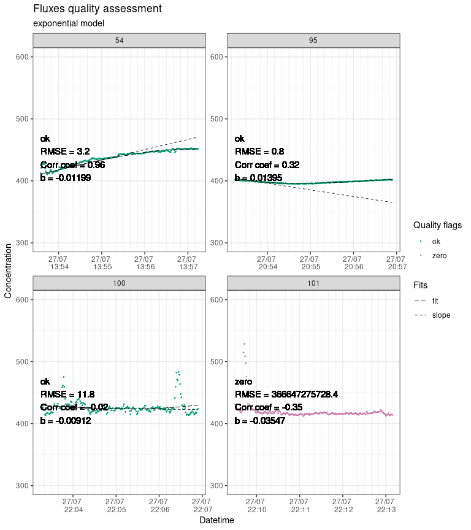
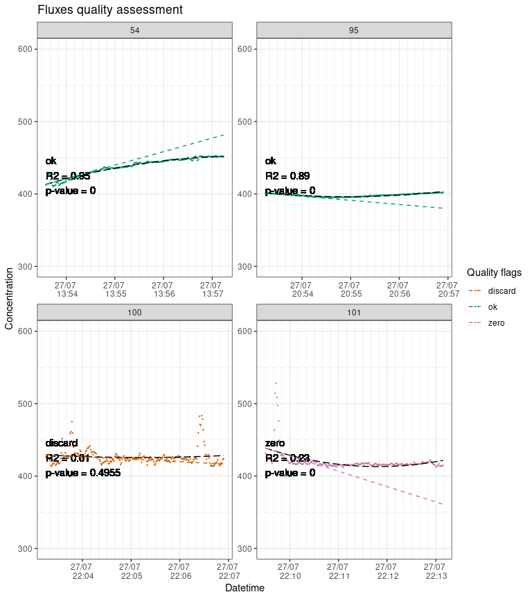
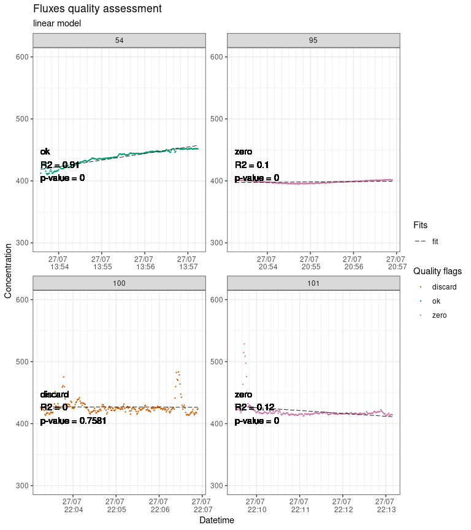
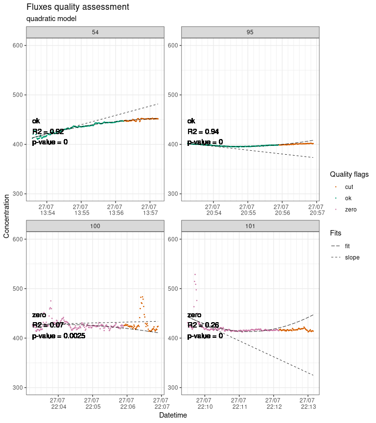

<!-- README.md is generated from README.Rmd. Please edit that file -->

# Fluxible

**Note:** fluxible is still in an early phase, it is fully functional
but can be improved in many ways. Please get in touch for any problems
or suggestions.

<!-- badges: start -->
<!-- badges: end -->

The Fluxible R package is made to transform any dataset of gas
concentration over time into a gas flux dataset. It was originally made
to be used with a closed loop chamber system connected to a gas
analyzer. A function for use with a tent (taking leakage into account)
is in development (see further developments).

The goal of fluxible is to provide a workflow that removes individual
evaluation of each flux, reduces risk of bias, and makes it
reproducible. Users set specific data quality standards and selection
parameters as function arguments that are applied to the entire dataset.
The package runs the calculations automatically, without prompting the
user to take decisions mid-way, and provides quality flags and plots at
the end of the process for a visual check. This makes it easy to use
with large flux datasets and to integrate into a reproducible workflow.
Using the Fluxible R package makes the workflow reproducible, increases
compatibility across studies, and is more time efficient.

For a quick overview of how the package works, you can look at [the
poster](https://github.com/Plant-Functional-Trait-Course/fluxible/blob/main/dissemination/poster_EGU24_jgaudard.pdf)
that was presented at the European Geosciences Union Annual Meeting
2024.

## Installation

You can install the development version of fluxible from the [GitHub
repo](https://github.com/Plant-Functional-Trait-Course/fluxible) with:

``` r
# install.packages("devtools")
devtools::install_github("plant-functional-trait-course/fluxible")
```

## Example

For this example we will use the data that were recorded during the
Plant Functional Traits Course 6 (PFTC6) in Norway in 2022 at the site
called Liahovden. <!-- (CITE when data paper out). --> The
CO<sub>2</sub> concentration data as well as air and soil temperature
and photosynthetically active radiations (PAR) were recorded in a
dataframe named `co2_liahovden`. The metadata for each measurements are
in a dataframe called `record_liahovden`. This dataframe contains the
starting time of each measurements, the type of measurement and the
unique ID for each turf. The type of measurement describes if it was net
ecosystem exchange (NEE), measured with a transparent chamber, or
ecosystem respiration (ER), measured with a dark chamber.

We use the `flux_match` function to slice the data from `co2_liahovden`
into each measurement and discard what was recorded in between.

``` r
library(fluxible)

str(record_liahovden)
#> tibble [138 × 3] (S3: tbl_df/tbl/data.frame)
#>  $ turfID: chr [1:138] "4 AN1C 4" "4 AN1C 4" "27 AN3C 27" "27 AN3C 27" ...
#>  $ type  : chr [1:138] "NEE" "ER" "NEE" "ER" ...
#>  $ start : POSIXct[1:138], format: "2022-07-27 05:37:30" "2022-07-27 05:42:00" ...
str(co2_liahovden)
#> tibble [89,692 × 5] (S3: tbl_df/tbl/data.frame)
#>  $ datetime : POSIXct[1:89692], format: "2022-07-27 05:34:49" "2022-07-27 05:34:50" ...
#>  $ temp_air : num [1:89692] 3 NA NA NA NA NA NA NA NA NA ...
#>  $ temp_soil: num [1:89692] 2.96 NA NA NA NA NA NA NA NA NA ...
#>  $ conc     : num [1:89692] 468 469 468 468 468 ...
#>  $ PAR      : num [1:89692] 2.59 NA NA NA NA NA NA NA NA NA ...

conc_liahovden <- flux_match(
  raw_conc = co2_liahovden,
  field_record = record_liahovden,
  startcrop = 0,
  measurement_length = 220,
  ratio_threshold = 0.5,
  time_diff = 0,
  datetime_col = "datetime",
  conc_col = "conc",
  start_col = "start"
)
str(conc_liahovden)
#> tibble [30,281 × 13] (S3: tbl_df/tbl/data.frame)
#>  $ f_datetime  : POSIXct[1:30281], format: "2022-07-27 05:37:30" "2022-07-27 05:37:31" ...
#>  $ temp_air    : num [1:30281] NA NA NA NA NA NA NA NA NA 3 ...
#>  $ temp_soil   : num [1:30281] NA NA NA NA NA NA NA NA NA 6.83 ...
#>  $ f_conc      : num [1:30281] 468 467 467 467 467 ...
#>  $ PAR         : num [1:30281] NA NA NA NA NA ...
#>  $ turfID      : chr [1:30281] "4 AN1C 4" "4 AN1C 4" "4 AN1C 4" "4 AN1C 4" ...
#>  $ type        : chr [1:30281] "NEE" "NEE" "NEE" "NEE" ...
#>  $ f_start     : POSIXct[1:30281], format: "2022-07-27 05:37:30" "2022-07-27 05:37:30" ...
#>  $ f_end       : POSIXct[1:30281], format: "2022-07-27 05:41:10" "2022-07-27 05:41:10" ...
#>  $ f_fluxID    : Factor w/ 138 levels "1","2","3","4",..: 1 1 1 1 1 1 1 1 1 1 ...
#>  $ f_n_conc    : int [1:30281] 220 220 220 220 220 220 220 220 220 220 ...
#>  $ f_ratio     : num [1:30281] 1 1 1 1 1 1 1 1 1 1 ...
#>  $ f_flag_match: chr [1:30281] NA NA NA NA ...
```

Before calculating fluxes we need to fit a model to each measurement and
estimate a slope of the concentration changing rate. We use the
`flux_fitting` function with the model provided by Zhao *et al.* (2018).
The function `flux_fitting` also provides a quadratic and a linear fit.

``` r
slopes_exp_liahovden <- flux_fitting(
  conc_df = conc_liahovden,
  start_cut = 0,
  end_cut = 0,
  start_col = "f_start",
  end_col = "f_end",
  datetime_col = "f_datetime",
  conc_col = "f_conc",
  fluxid_col = "f_fluxID",
  t_window = 20,
  cz_window = 15,
  b_window = 10,
  a_window = 10,
  roll_width = 15,
  t_zero = 0,
  fit_type = "exponential"
)
#> Cutting measurements...
#> Estimating starting parameters for optimization...
#> Optimizing fitting parameters...
#> Calculating fits and slopes...
#> Done.
#> Warning in flux_fitting_exp(conc_df, start_cut = ((start_cut)), end_cut = ((end_cut)), : 
#>  fluxID 77 : slope was estimated on 194 points out of 220 seconds
#>  fluxID 81 : slope was estimated on 217 points out of 220 seconds
#>  fluxID 83 : slope was estimated on 215 points out of 220 seconds
#>  fluxID 85 : slope was estimated on 175 points out of 220 seconds
str(slopes_exp_liahovden)
#> tibble [30,281 × 30] (S3: tbl_df/tbl/data.frame)
#>  $ f_datetime  : POSIXct[1:30281], format: "2022-07-27 05:37:30" "2022-07-27 05:37:31" ...
#>  $ temp_air    : num [1:30281] NA NA NA NA NA NA NA NA NA 3 ...
#>  $ temp_soil   : num [1:30281] NA NA NA NA NA NA NA NA NA 6.83 ...
#>  $ f_conc      : num [1:30281] 468 467 467 467 467 ...
#>  $ PAR         : num [1:30281] NA NA NA NA NA ...
#>  $ turfID      : chr [1:30281] "4 AN1C 4" "4 AN1C 4" "4 AN1C 4" "4 AN1C 4" ...
#>  $ type        : chr [1:30281] "NEE" "NEE" "NEE" "NEE" ...
#>  $ f_start     : POSIXct[1:30281], format: "2022-07-27 05:37:30" "2022-07-27 05:37:30" ...
#>  $ f_end       : POSIXct[1:30281], format: "2022-07-27 05:41:10" "2022-07-27 05:41:10" ...
#>  $ f_fluxID    : Factor w/ 138 levels "1","2","3","4",..: 1 1 1 1 1 1 1 1 1 1 ...
#>  $ f_n_conc    : int [1:30281] 220 220 220 220 220 220 220 220 220 220 ...
#>  $ f_ratio     : num [1:30281] 1 1 1 1 1 1 1 1 1 1 ...
#>  $ f_flag_match: chr [1:30281] NA NA NA NA ...
#>  $ f_time      : num [1:30281] 0 1 2 3 4 5 6 7 8 9 ...
#>  $ f_cut       : Factor w/ 1 level "keep": 1 1 1 1 1 1 1 1 1 1 ...
#>  $ n_conc      : int [1:30281] 220 220 220 220 220 220 220 220 220 220 ...
#>  $ Cm_est      : num [1:30281] 435 435 435 435 435 ...
#>  $ a_est       : num [1:30281] -0.249 -0.249 -0.249 -0.249 -0.249 ...
#>  $ b_est       : num [1:30281] -0.00288 -0.00288 -0.00288 -0.00288 -0.00288 ...
#>  $ tz_est      : num [1:30281] 14 14 14 14 14 14 14 14 14 14 ...
#>  $ f_Cz        : num [1:30281] 467 467 467 467 467 ...
#>  $ time_diff   : num [1:30281] 0 0 0 0 0 0 0 0 0 0 ...
#>  $ f_Cm        : num [1:30281] 372 372 372 372 372 ...
#>  $ f_a         : num [1:30281] -0.402 -0.402 -0.402 -0.402 -0.402 ...
#>  $ f_b         : num [1:30281] -0.00229 -0.00229 -0.00229 -0.00229 -0.00229 ...
#>  $ f_tz        : num [1:30281] 13.2 13.2 13.2 13.2 13.2 ...
#>  $ f_slope     : num [1:30281] -0.184 -0.184 -0.184 -0.184 -0.184 ...
#>  $ f_fit       : num [1:30281] 470 470 470 469 469 ...
#>  $ f_fit_slope : num [1:30281] 470 470 470 469 469 ...
#>  $ f_start_z   : POSIXct[1:30281], format: "2022-07-27 05:37:43" "2022-07-27 05:37:43" ...
#>  - attr(*, "fit_type")= chr "exponential"

slopes_qua_liahovden <- flux_fitting(
  conc_df = conc_liahovden,
  start_cut = 0,
  end_cut = 0,
  start_col = "f_start",
  end_col = "f_end",
  datetime_col = "f_datetime",
  conc_col = "f_conc",
  fluxid_col = "f_fluxID",
  t_window = 20,
  cz_window = 15,
  b_window = 10,
  a_window = 10,
  roll_width = 15,
  t_zero = 5,
  fit_type = "quadratic"
)
#> Warning in flux_fitting_quadratic(conc_df, start_cut = ((start_cut)), end_cut = ((end_cut)), : 
#>  fluxID 77 : slope was estimated on 194 points out of 220 seconds because data are missing
#>  fluxID 81 : slope was estimated on 217 points out of 220 seconds because data are missing
#>  fluxID 83 : slope was estimated on 215 points out of 220 seconds because data are missing
#>  fluxID 85 : slope was estimated on 175 points out of 220 seconds because data are missing
str(slopes_qua_liahovden)
#> tibble [30,281 × 25] (S3: tbl_df/tbl/data.frame)
#>  $ f_datetime    : POSIXct[1:30281], format: "2022-07-27 05:37:30" "2022-07-27 05:37:31" ...
#>  $ temp_air      : num [1:30281] NA NA NA NA NA NA NA NA NA 3 ...
#>  $ temp_soil     : num [1:30281] NA NA NA NA NA NA NA NA NA 6.83 ...
#>  $ f_conc        : num [1:30281] 468 467 467 467 467 ...
#>  $ PAR           : num [1:30281] NA NA NA NA NA ...
#>  $ turfID        : chr [1:30281] "4 AN1C 4" "4 AN1C 4" "4 AN1C 4" "4 AN1C 4" ...
#>  $ type          : chr [1:30281] "NEE" "NEE" "NEE" "NEE" ...
#>  $ f_start       : POSIXct[1:30281], format: "2022-07-27 05:37:30" "2022-07-27 05:37:30" ...
#>  $ f_end         : POSIXct[1:30281], format: "2022-07-27 05:41:10" "2022-07-27 05:41:10" ...
#>  $ f_fluxID      : Factor w/ 138 levels "1","2","3","4",..: 1 1 1 1 1 1 1 1 1 1 ...
#>  $ f_n_conc      : int [1:30281] 220 220 220 220 220 220 220 220 220 220 ...
#>  $ f_ratio       : num [1:30281] 1 1 1 1 1 1 1 1 1 1 ...
#>  $ f_flag_match  : chr [1:30281] NA NA NA NA ...
#>  $ f_time        : num [1:30281] 0 1 2 3 4 5 6 7 8 9 ...
#>  $ f_cut         : Factor w/ 1 level "keep": 1 1 1 1 1 1 1 1 1 1 ...
#>  $ n_conc        : int [1:30281] 220 220 220 220 220 220 220 220 220 220 ...
#>  $ f_rsquared    : num [1:30281] 0.967 0.967 0.967 0.967 0.967 ...
#>  $ f_adj_rsquared: num [1:30281] 0.966 0.966 0.966 0.966 0.966 ...
#>  $ f_pvalue      : Named num [1:30281] 9.07e-161 9.07e-161 9.07e-161 9.07e-161 9.07e-161 ...
#>   ..- attr(*, "names")= chr [1:30281] "value" "value" "value" "value" ...
#>  $ f_intercept   : num [1:30281] 465 465 465 465 465 ...
#>  $ f_param1      : num [1:30281] -0.11 -0.11 -0.11 -0.11 -0.11 ...
#>  $ f_param2      : num [1:30281] 3.9e-06 3.9e-06 3.9e-06 3.9e-06 3.9e-06 ...
#>  $ f_slope       : num [1:30281] -0.11 -0.11 -0.11 -0.11 -0.11 ...
#>  $ f_fit         : num [1:30281] 465 465 464 464 464 ...
#>  $ f_fit_slope   : num [1:30281] 465 465 464 464 464 ...
#>  - attr(*, "fit_type")= chr "quadratic"

slopes_lin_liahovden <- flux_fitting(
  conc_df = conc_liahovden,
  start_cut = 0,
  end_cut = 0,
  start_col = "f_start",
  end_col = "f_end",
  datetime_col = "f_datetime",
  conc_col = "f_conc",
  fluxid_col = "f_fluxID",
  t_window = 20,
  cz_window = 15,
  b_window = 10,
  a_window = 10,
  roll_width = 15,
  t_zero = 5,
  fit_type = "linear"
)
#> Warning in flux_fitting_lin(conc_df, start_cut = ((start_cut)), end_cut = ((end_cut)), : 
#>  fluxID 77 : slope was estimated on 194 points out of 220 seconds
#>  fluxID 81 : slope was estimated on 217 points out of 220 seconds
#>  fluxID 83 : slope was estimated on 215 points out of 220 seconds
#>  fluxID 85 : slope was estimated on 175 points out of 220 seconds
str(slopes_lin_liahovden)
#> tibble [30,281 × 22] (S3: tbl_df/tbl/data.frame)
#>  $ f_datetime    : POSIXct[1:30281], format: "2022-07-27 05:37:30" "2022-07-27 05:37:31" ...
#>  $ temp_air      : num [1:30281] NA NA NA NA NA NA NA NA NA 3 ...
#>  $ temp_soil     : num [1:30281] NA NA NA NA NA NA NA NA NA 6.83 ...
#>  $ f_conc        : num [1:30281] 468 467 467 467 467 ...
#>  $ PAR           : num [1:30281] NA NA NA NA NA ...
#>  $ turfID        : chr [1:30281] "4 AN1C 4" "4 AN1C 4" "4 AN1C 4" "4 AN1C 4" ...
#>  $ type          : chr [1:30281] "NEE" "NEE" "NEE" "NEE" ...
#>  $ f_start       : POSIXct[1:30281], format: "2022-07-27 05:37:30" "2022-07-27 05:37:30" ...
#>  $ f_end         : POSIXct[1:30281], format: "2022-07-27 05:41:10" "2022-07-27 05:41:10" ...
#>  $ f_fluxID      : Factor w/ 138 levels "1","2","3","4",..: 1 1 1 1 1 1 1 1 1 1 ...
#>  $ f_n_conc      : int [1:30281] 220 220 220 220 220 220 220 220 220 220 ...
#>  $ f_ratio       : num [1:30281] 1 1 1 1 1 1 1 1 1 1 ...
#>  $ f_flag_match  : chr [1:30281] NA NA NA NA ...
#>  $ f_time        : num [1:30281] 0 1 2 3 4 5 6 7 8 9 ...
#>  $ f_cut         : Factor w/ 1 level "keep": 1 1 1 1 1 1 1 1 1 1 ...
#>  $ n_conc        : int [1:30281] 220 220 220 220 220 220 220 220 220 220 ...
#>  $ f_rsquared    : num [1:30281] 0.967 0.967 0.967 0.967 0.967 ...
#>  $ f_adj_rsquared: num [1:30281] 0.966 0.966 0.966 0.966 0.966 ...
#>  $ f_pvalue      : Named num [1:30281] 9.23e-163 9.23e-163 9.23e-163 9.23e-163 9.23e-163 ...
#>   ..- attr(*, "names")= chr [1:30281] "value" "value" "value" "value" ...
#>  $ f_intercept   : num [1:30281] 465 465 465 465 465 ...
#>  $ f_slope       : num [1:30281] -0.109 -0.109 -0.109 -0.109 -0.109 ...
#>  $ f_fit         : num [1:30281] 465 465 464 464 464 ...
#>  - attr(*, "fit_type")= chr "linear"
```

The function `flux_quality` is used to provide diagnostics about the
quality of the fit, eventually advising to discard some measurements or
replace them by zero.

``` r
slopes_exp_liahovden_flag <- flux_quality(
  slopes_df = slopes_exp_liahovden,
  # fit_type is automatically provided as an attribute because
  # slopes_exp_liahovden was produced with flux_fitting
  ambient_conc = 421,
  error = 100,
  fluxid_col = "f_fluxID",
  slope_col = "f_slope",
  weird_fluxes_id = c(),
  force_ok_id = c(),
  ratio_threshold = 0,
  conc_col = "f_conc",
  b_col = "f_b",
  time_col = "f_time",
  fit_col = "f_fit",
  cut_col = "f_cut",
  rmse_threshold = 25,
  cor_threshold = 0.5,
  b_threshold = 1,
  cut_arg = "cut"
)
#> 
#>  Total number of measurements: 138
#> 
#>  discard      4   3 %
#>  ok   130     94 %
#>  zero     4   3 %
#>  weird_flux   0   0 %
#>  start_error      0   0 %
#>  no_data      0   0 %
#>  force_ok     0   0 %
str(slopes_exp_liahovden_flag)
#> tibble [30,281 × 38] (S3: tbl_df/tbl/data.frame)
#>  $ f_datetime    : POSIXct[1:30281], format: "2022-07-27 05:37:30" "2022-07-27 05:37:31" ...
#>  $ temp_air      : num [1:30281] NA NA NA NA NA NA NA NA NA 3 ...
#>  $ temp_soil     : num [1:30281] NA NA NA NA NA NA NA NA NA 6.83 ...
#>  $ f_conc        : num [1:30281] 468 467 467 467 467 ...
#>  $ PAR           : num [1:30281] NA NA NA NA NA ...
#>  $ turfID        : chr [1:30281] "4 AN1C 4" "4 AN1C 4" "4 AN1C 4" "4 AN1C 4" ...
#>  $ type          : chr [1:30281] "NEE" "NEE" "NEE" "NEE" ...
#>  $ f_start       : POSIXct[1:30281], format: "2022-07-27 05:37:30" "2022-07-27 05:37:30" ...
#>  $ f_end         : POSIXct[1:30281], format: "2022-07-27 05:41:10" "2022-07-27 05:41:10" ...
#>  $ f_fluxID      : Factor w/ 138 levels "1","2","3","4",..: 1 1 1 1 1 1 1 1 1 1 ...
#>  $ f_n_conc      : int [1:30281] 220 220 220 220 220 220 220 220 220 220 ...
#>  $ f_ratio       : num [1:30281] 1 1 1 1 1 1 1 1 1 1 ...
#>  $ f_flag_match  : chr [1:30281] NA NA NA NA ...
#>  $ f_time        : num [1:30281] 0 1 2 3 4 5 6 7 8 9 ...
#>  $ f_cut         : Factor w/ 1 level "keep": 1 1 1 1 1 1 1 1 1 1 ...
#>  $ n_conc        : int [1:30281] 220 220 220 220 220 220 220 220 220 220 ...
#>  $ Cm_est        : num [1:30281] 435 435 435 435 435 ...
#>  $ a_est         : num [1:30281] -0.249 -0.249 -0.249 -0.249 -0.249 ...
#>  $ b_est         : num [1:30281] -0.00288 -0.00288 -0.00288 -0.00288 -0.00288 ...
#>  $ tz_est        : num [1:30281] 14 14 14 14 14 14 14 14 14 14 ...
#>  $ f_Cz          : num [1:30281] 467 467 467 467 467 ...
#>  $ time_diff     : num [1:30281] 0 0 0 0 0 0 0 0 0 0 ...
#>  $ f_Cm          : num [1:30281] 372 372 372 372 372 ...
#>  $ f_a           : num [1:30281] -0.402 -0.402 -0.402 -0.402 -0.402 ...
#>  $ f_b           : num [1:30281] -0.00229 -0.00229 -0.00229 -0.00229 -0.00229 ...
#>  $ f_tz          : num [1:30281] 13.2 13.2 13.2 13.2 13.2 ...
#>  $ f_slope       : num [1:30281] -0.184 -0.184 -0.184 -0.184 -0.184 ...
#>  $ f_fit         : num [1:30281] 470 470 470 469 469 ...
#>  $ f_fit_slope   : num [1:30281] 470 470 470 469 469 ...
#>  $ f_start_z     : POSIXct[1:30281], format: "2022-07-27 05:37:43" "2022-07-27 05:37:43" ...
#>  $ f_flag_ratio  : chr [1:30281] "ok" "ok" "ok" "ok" ...
#>  $ f_start_error : chr [1:30281] "ok" "ok" "ok" "ok" ...
#>  $ f_cor_coef    : num [1:30281] -0.983 -0.983 -0.983 -0.983 -0.983 ...
#>  $ f_RMSE        : num [1:30281] 2.25 2.25 2.25 2.25 2.25 ...
#>  $ f_fit_quality : chr [1:30281] NA NA NA NA ...
#>  $ f_correlation : chr [1:30281] "yes" "yes" "yes" "yes" ...
#>  $ f_quality_flag: chr [1:30281] "ok" "ok" "ok" "ok" ...
#>  $ f_slope_corr  : num [1:30281] -0.184 -0.184 -0.184 -0.184 -0.184 ...
#>  - attr(*, "fit_type")= chr "exponential"

slopes_qua_liahovden_flag <- flux_quality(
  slopes_df = slopes_qua_liahovden,
  # fit_type is automatically provided as an attribute because
  # slopes_exp_liahovden was produced with flux_fitting
  ambient_conc = 421,
  error = 100,
  fluxid_col = "f_fluxID",
  slope_col = "f_slope",
  weird_fluxes_id = c(),
  force_ok_id = c(),
  ratio_threshold = 0,
  pvalue_col = "f_pvalue",
  rsquared_col = "f_rsquared",
  pvalue_threshold = 0.3,
  rsquared_threshold = 0.7,
  conc_col = "f_conc",
  time_col = "f_time",
  fit_col = "f_fit",
  cut_col = "f_cut",
  cut_arg = "cut"
)
#> 
#>  Total number of measurements: 138
#> 
#>  discard      1   1 %
#>  ok   86      62 %
#>  zero     51      37 %
#>  weird_flux   0   0 %
#>  start_error      0   0 %
#>  no_data      0   0 %
#>  force_ok     0   0 %
str(slopes_qua_liahovden_flag)
#> tibble [30,281 × 29] (S3: tbl_df/tbl/data.frame)
#>  $ f_datetime    : POSIXct[1:30281], format: "2022-07-27 05:37:30" "2022-07-27 05:37:31" ...
#>  $ temp_air      : num [1:30281] NA NA NA NA NA NA NA NA NA 3 ...
#>  $ temp_soil     : num [1:30281] NA NA NA NA NA NA NA NA NA 6.83 ...
#>  $ f_conc        : num [1:30281] 468 467 467 467 467 ...
#>  $ PAR           : num [1:30281] NA NA NA NA NA ...
#>  $ turfID        : chr [1:30281] "4 AN1C 4" "4 AN1C 4" "4 AN1C 4" "4 AN1C 4" ...
#>  $ type          : chr [1:30281] "NEE" "NEE" "NEE" "NEE" ...
#>  $ f_start       : POSIXct[1:30281], format: "2022-07-27 05:37:30" "2022-07-27 05:37:30" ...
#>  $ f_end         : POSIXct[1:30281], format: "2022-07-27 05:41:10" "2022-07-27 05:41:10" ...
#>  $ f_fluxID      : Factor w/ 138 levels "1","2","3","4",..: 1 1 1 1 1 1 1 1 1 1 ...
#>  $ f_n_conc      : int [1:30281] 220 220 220 220 220 220 220 220 220 220 ...
#>  $ f_ratio       : num [1:30281] 1 1 1 1 1 1 1 1 1 1 ...
#>  $ f_flag_match  : chr [1:30281] NA NA NA NA ...
#>  $ f_time        : num [1:30281] 0 1 2 3 4 5 6 7 8 9 ...
#>  $ f_cut         : Factor w/ 1 level "keep": 1 1 1 1 1 1 1 1 1 1 ...
#>  $ n_conc        : int [1:30281] 220 220 220 220 220 220 220 220 220 220 ...
#>  $ f_rsquared    : num [1:30281] 0.967 0.967 0.967 0.967 0.967 ...
#>  $ f_adj_rsquared: num [1:30281] 0.966 0.966 0.966 0.966 0.966 ...
#>  $ f_pvalue      : Named num [1:30281] 9.07e-161 9.07e-161 9.07e-161 9.07e-161 9.07e-161 ...
#>   ..- attr(*, "names")= chr [1:30281] "value" "value" "value" "value" ...
#>  $ f_intercept   : num [1:30281] 465 465 465 465 465 ...
#>  $ f_param1      : num [1:30281] -0.11 -0.11 -0.11 -0.11 -0.11 ...
#>  $ f_param2      : num [1:30281] 3.9e-06 3.9e-06 3.9e-06 3.9e-06 3.9e-06 ...
#>  $ f_slope       : num [1:30281] -0.11 -0.11 -0.11 -0.11 -0.11 ...
#>  $ f_fit         : num [1:30281] 465 465 464 464 464 ...
#>  $ f_fit_slope   : num [1:30281] 465 465 464 464 464 ...
#>  $ f_flag_ratio  : chr [1:30281] "ok" "ok" "ok" "ok" ...
#>  $ f_start_error : chr [1:30281] "ok" "ok" "ok" "ok" ...
#>  $ f_quality_flag: chr [1:30281] "ok" "ok" "ok" "ok" ...
#>  $ f_slope_corr  : num [1:30281] -0.11 -0.11 -0.11 -0.11 -0.11 ...
#>  - attr(*, "fit_type")= chr "quadratic"

slopes_lin_liahovden_flag <- flux_quality(
  slopes_df = slopes_lin_liahovden,
  # fit_type is automatically provided as an attribute because
  # slopes_exp_liahovden was produced with flux_fitting
  ambient_conc = 421,
  error = 100,
  fluxid_col = "f_fluxID",
  slope_col = "f_slope",
  weird_fluxes_id = c(),
  force_ok_id = c(),
  ratio_threshold = 0,
  pvalue_col = "f_pvalue",
  rsquared_col = "f_rsquared",
  pvalue_threshold = 0.3,
  rsquared_threshold = 0.7,
  conc_col = "f_conc",
  time_col = "f_time",
  fit_col = "f_fit",
  cut_col = "f_cut",
  cut_arg = "cut"
)
#> 
#>  Total number of measurements: 138
#> 
#>  discard      6   4 %
#>  ok   52      38 %
#>  zero     80      58 %
#>  weird_flux   0   0 %
#>  start_error      0   0 %
#>  no_data      0   0 %
#>  force_ok     0   0 %
str(slopes_lin_liahovden_flag)
#> tibble [30,281 × 26] (S3: tbl_df/tbl/data.frame)
#>  $ f_datetime    : POSIXct[1:30281], format: "2022-07-27 05:37:30" "2022-07-27 05:37:31" ...
#>  $ temp_air      : num [1:30281] NA NA NA NA NA NA NA NA NA 3 ...
#>  $ temp_soil     : num [1:30281] NA NA NA NA NA NA NA NA NA 6.83 ...
#>  $ f_conc        : num [1:30281] 468 467 467 467 467 ...
#>  $ PAR           : num [1:30281] NA NA NA NA NA ...
#>  $ turfID        : chr [1:30281] "4 AN1C 4" "4 AN1C 4" "4 AN1C 4" "4 AN1C 4" ...
#>  $ type          : chr [1:30281] "NEE" "NEE" "NEE" "NEE" ...
#>  $ f_start       : POSIXct[1:30281], format: "2022-07-27 05:37:30" "2022-07-27 05:37:30" ...
#>  $ f_end         : POSIXct[1:30281], format: "2022-07-27 05:41:10" "2022-07-27 05:41:10" ...
#>  $ f_fluxID      : Factor w/ 138 levels "1","2","3","4",..: 1 1 1 1 1 1 1 1 1 1 ...
#>  $ f_n_conc      : int [1:30281] 220 220 220 220 220 220 220 220 220 220 ...
#>  $ f_ratio       : num [1:30281] 1 1 1 1 1 1 1 1 1 1 ...
#>  $ f_flag_match  : chr [1:30281] NA NA NA NA ...
#>  $ f_time        : num [1:30281] 0 1 2 3 4 5 6 7 8 9 ...
#>  $ f_cut         : Factor w/ 1 level "keep": 1 1 1 1 1 1 1 1 1 1 ...
#>  $ n_conc        : int [1:30281] 220 220 220 220 220 220 220 220 220 220 ...
#>  $ f_rsquared    : num [1:30281] 0.967 0.967 0.967 0.967 0.967 ...
#>  $ f_adj_rsquared: num [1:30281] 0.966 0.966 0.966 0.966 0.966 ...
#>  $ f_pvalue      : Named num [1:30281] 9.23e-163 9.23e-163 9.23e-163 9.23e-163 9.23e-163 ...
#>   ..- attr(*, "names")= chr [1:30281] "value" "value" "value" "value" ...
#>  $ f_intercept   : num [1:30281] 465 465 465 465 465 ...
#>  $ f_slope       : num [1:30281] -0.109 -0.109 -0.109 -0.109 -0.109 ...
#>  $ f_fit         : num [1:30281] 465 465 464 464 464 ...
#>  $ f_flag_ratio  : chr [1:30281] "ok" "ok" "ok" "ok" ...
#>  $ f_start_error : chr [1:30281] "ok" "ok" "ok" "ok" ...
#>  $ f_quality_flag: chr [1:30281] "ok" "ok" "ok" "ok" ...
#>  $ f_slope_corr  : num [1:30281] -0.109 -0.109 -0.109 -0.109 -0.109 ...
#>  - attr(*, "fit_type")= chr "linear"
```

The function `flux_plot` provides plots for a visual assessment of the
measurements, explicitly displaying the quality flags from
`flux_quality` and the cuts from `flux_fitting`.

``` r
slopes_exp_liahovden_flag |>
  # we just show a sample of the plots to avoid slowing down the example
  dplyr::filter(f_fluxID %in% c(54, 95, 100, 101)) |>
  flux_plot(
    color_discard = "#D55E00",
    color_cut = "#D55E00",
    color_ok = "#009E73",
    color_zero = "#CC79A7",
    f_date_breaks = "1 min",
    f_minor_breaks = "10 sec",
    f_date_labels = "%e/%m \n %H:%M",
    f_ylim_upper = 600,
    f_ylim_lower = 300,
    f_plotname = "plot_quality",
    facet_wrap_args = list(
      ncol = 2,
      nrow = 2,
      scales = "free"
    ),
    y_text_position = 400,
    print_plot = "FALSE",
    output = "print_only",
    cut_arg = "cut",
    no_data_flag = "no_data"
  )
#> Part of the fit will not be displayed
#>     because f_ylim_upper is too low.
#> Part of the fit will not be displayed
#>     because f_ylim_lower is too high.
#> Plotting in progress
```



``` r

slopes_qua_liahovden_flag |>
  # we just show a sample of the plots to avoid slowing down the example
  dplyr::filter(f_fluxID %in% c(54, 95, 100, 101)) |>
  flux_plot(
    color_discard = "#D55E00",
    color_cut = "#D55E00",
    color_ok = "#009E73",
    color_zero = "#CC79A7",
    f_date_breaks = "1 min",
    f_minor_breaks = "10 sec",
    f_date_labels = "%e/%m \n %H:%M",
    f_ylim_upper = 600,
    f_ylim_lower = 300,
    f_plotname = "plot_quality",
    facet_wrap_args = list(
      ncol = 2,
      nrow = 2,
      scales = "free"
    ),
    y_text_position = 400,
    print_plot = "FALSE",
    output = "print_only",
    cut_arg = "cut",
    no_data_flag = "no_data"
  )
#> Plotting in progress
```



``` r

slopes_lin_liahovden_flag |>
  # we just show a sample of the plots to avoid slowing down the example
  dplyr::filter(f_fluxID %in% c(54, 95, 100, 101)) |>
  flux_plot(
    color_discard = "#D55E00",
    color_cut = "#D55E00",
    color_ok = "#009E73",
    color_zero = "#CC79A7",
    f_date_breaks = "1 min",
    f_minor_breaks = "10 sec",
    f_date_labels = "%e/%m \n %H:%M",
    f_ylim_upper = 600,
    f_ylim_lower = 300,
    f_plotname = "plot_quality",
    facet_wrap_args = list(
      ncol = 2,
      nrow = 2,
      scales = "free"
    ),
    y_text_position = 400,
    print_plot = "FALSE",
    output = "print_only",
    cut_arg = "cut",
    no_data_flag = "no_data"
  )
#> Plotting in progress
```



Based on the quality flags and the plots, the user can decide to run
`flux_fitting` again with different arguments. Here we will do it while
cutting the last 60 seconds of the fluxes (cutting the last third). We
also detected fluxes that do not look correct. Sometimes some
measurements will pass the automated quality control but are obviously
wrong for an experience user. That is what the `weird_fluxesID` argument
is for. For the sake of reproducibility, this argument should be the
last option and be accompanied with a justification.

``` r
slopes_exp_liahovden_flag_60 <- conc_liahovden |>
  flux_fitting(fit_type = "exp", end_cut = 60) |>
  flux_quality(
    slope_col = "f_slope",
    weird_fluxes_id = c(
      51, # slope is much steeper than the flux because t zero was estimated
      # at the very start of the measurement
      101, # plot starts with a high peak: accumulation in the canopy?
      106 # peak at the beginning of the flux that is messing up the fit
    )
  )
#> Cutting measurements...
#> Estimating starting parameters for optimization...
#> Optimizing fitting parameters...
#> Calculating fits and slopes...
#> Done.
#> 
#>  Total number of measurements: 138
#> 
#>  discard      1   1 %
#>  ok   131     95 %
#>  weird_flux   3   2 %
#>  zero     3   2 %
#>  start_error      0   0 %
#>  no_data      0   0 %
#>  force_ok     0   0 %

slopes_exp_liahovden_flag_60 |>
  # we just show a sample of the plots to avoid slowing down the example
  dplyr::filter(f_fluxID %in% c(54, 95, 100, 101)) |>
  flux_plot(
    f_ylim_lower = 300,
    f_ylim_upper = 600,
    facet_wrap_args = list(
      ncol = 2,
      nrow = 2,
      scales = "free"
    ),
    y_text_position = 400,
    output = "print_only"
  )
#> Part of the fit will not be displayed
#>     because f_ylim_lower is too high.
#> Plotting in progress
```


We also apply a cut on the dataset that was fitted with a quadratic
model. At this point it is up to the user to decide which model works
the best for the entire dataset. The function flux_quality provides a
count of the quality flags that can help to take a decision.

``` r
slopes_qua_liahovden_flag_60 <- conc_liahovden |>
  flux_fitting(fit_type = "qua", end_cut = 60, t_zero = 5) |>
  flux_quality(
    slope_col = "f_slope"
  )
#> 
#>  Total number of measurements: 138
#> 
#>  ok   121     88 %
#>  zero     17      12 %
#>  discard      0   0 %
#>  weird_flux   0   0 %
#>  start_error      0   0 %
#>  no_data      0   0 %
#>  force_ok     0   0 %

slopes_qua_liahovden_flag_60 |>
  # we just show a sample of the plots to avoid slowing down the example
  dplyr::filter(f_fluxID %in% c(54, 95, 100, 101)) |>
  flux_plot(
    f_ylim_lower = 300,
    f_ylim_upper = 600,
    facet_wrap_args = list(
      ncol = 2,
      nrow = 2,
      scales = "free"
    ),
    y_text_position = 400,
    output = "print_only"
  )
#> Plotting in progress
```



When using a linear fit it is common to take only a short section of the
measurement close to the start. Here we will cut 120 seconds at the end,
effectively keeping only the first 90 seconds.

``` r
slopes_lin_liahovden_flag_120 <- conc_liahovden |>
  flux_fitting(fit_type = "lin", end_cut = 120, t_zero = 5) |>
  flux_quality(
    slope_col = "f_slope"
  )
#> 
#>  Total number of measurements: 138
#> 
#>  discard      2   1 %
#>  ok   109     79 %
#>  zero     27      20 %
#>  weird_flux   0   0 %
#>  start_error      0   0 %
#>  no_data      0   0 %
#>  force_ok     0   0 %

slopes_lin_liahovden_flag_120 |>
  # we just show a sample of the plots to avoid slowing down the example
  dplyr::filter(f_fluxID %in% c(54, 95, 100, 101)) |>
  flux_plot(
    f_ylim_lower = 300,
    f_ylim_upper = 600,
    facet_wrap_args = list(
      ncol = 2,
      nrow = 2,
      scales = "free"
    ),
    y_text_position = 400,
    output = "print_only"
  )
#> Plotting in progress
```


Once we are satisfied with the fit, we can calculate fluxes with
`flux_calc`. Here the volume is defined as a constant for all the
measurements but it is also possible to provide a specific volume for
each plot in case that is different.

``` r
fluxes_exp_liahovden_60 <- slopes_exp_liahovden_flag_60 |>
  flux_calc(
    slope_col = "f_slope_corr", # we use the slopes provided by flux_quality
    datetime_col = "f_datetime",
    cut_col = "f_cut",
    keep_arg = "keep",
    chamber_volume = 24.5,
    tube_volume = 0.075,
    atm_pressure = 1,
    plot_area = 0.0625,
    cols_keep = c("f_start", "type"),
    cols_ave = c(),
    fluxid_col = "f_fluxID",
    temp_air_col = "temp_air",
    temp_air_unit = "celsius"
  )
#> Cutting data according to 'keep_arg'...
#> Averaging air temperature for each flux...
#> Creating a df with the columns from 'cols_keep' argument...
#> Calculating fluxes...
str(fluxes_exp_liahovden_60)
#> tibble [138 × 12] (S3: tbl_df/tbl/data.frame)
#>  $ f_start       : POSIXct[1:138], format: "2022-07-27 05:37:30" "2022-07-27 05:42:00" ...
#>  $ type          : chr [1:138] "NEE" "ER" "NEE" "ER" ...
#>  $ f_fluxID      : Factor w/ 138 levels "1","2","3","4",..: 1 2 3 4 5 6 7 8 9 10 ...
#>  $ f_slope_calc  : num [1:138] -0.2258 0.0718 -0.3718 0.2433 -0.2865 ...
#>  $ chamber_volume: num [1:138] 24.5 24.5 24.5 24.5 24.5 24.5 24.5 24.5 24.5 24.5 ...
#>  $ tube_volume   : num [1:138] 0.075 0.075 0.075 0.075 0.075 0.075 0.075 0.075 0.075 0.075 ...
#>  $ atm_pressure  : num [1:138] 1 1 1 1 1 1 1 1 1 1 ...
#>  $ temp_air_ave  : num [1:138] 3.21 3.3 3.15 2.96 2.81 ...
#>  $ datetime      : POSIXct[1:138], format: "2022-07-27 05:37:30" "2022-07-27 05:42:00" ...
#>  $ volume_setup  : num [1:138] 24.6 24.6 24.6 24.6 24.6 ...
#>  $ flux          : num [1:138] -14.09 4.48 -23.22 15.2 -17.91 ...
#>  $ model         : chr [1:138] "exponential" "exponential" "exponential" "exponential" ...
#>  - attr(*, "fit_type")= chr "exponential"

fluxes_qua_liahovden_60 <- slopes_qua_liahovden_flag_60 |>
  flux_calc(
    slope_col = "f_slope_corr", # we use the slopes provided by flux_quality
    datetime_col = "f_datetime",
    cut_col = "f_cut",
    keep_arg = "keep",
    chamber_volume = 24.5,
    tube_volume = 0.075,
    atm_pressure = 1,
    plot_area = 0.0625,
    cols_keep = c("f_start", "type"),
    cols_ave = c(),
    fluxid_col = "f_fluxID",
    temp_air_col = "temp_air",
    temp_air_unit = "celsius"
  )
#> Cutting data according to 'keep_arg'...
#> Averaging air temperature for each flux...
#> Creating a df with the columns from 'cols_keep' argument...
#> Calculating fluxes...
str(fluxes_qua_liahovden_60)
#> tibble [138 × 12] (S3: tbl_df/tbl/data.frame)
#>  $ f_start       : POSIXct[1:138], format: "2022-07-27 05:37:30" "2022-07-27 05:42:00" ...
#>  $ type          : chr [1:138] "NEE" "ER" "NEE" "ER" ...
#>  $ f_fluxID      : Factor w/ 138 levels "1","2","3","4",..: 1 2 3 4 5 6 7 8 9 10 ...
#>  $ f_slope_calc  : num [1:138] -0.1579 0.0589 -0.3782 0.1423 -0.1655 ...
#>  $ chamber_volume: num [1:138] 24.5 24.5 24.5 24.5 24.5 24.5 24.5 24.5 24.5 24.5 ...
#>  $ tube_volume   : num [1:138] 0.075 0.075 0.075 0.075 0.075 0.075 0.075 0.075 0.075 0.075 ...
#>  $ atm_pressure  : num [1:138] 1 1 1 1 1 1 1 1 1 1 ...
#>  $ temp_air_ave  : num [1:138] 3.21 3.3 3.15 2.96 2.81 ...
#>  $ datetime      : POSIXct[1:138], format: "2022-07-27 05:37:30" "2022-07-27 05:42:00" ...
#>  $ volume_setup  : num [1:138] 24.6 24.6 24.6 24.6 24.6 ...
#>  $ flux          : num [1:138] -9.85 3.67 -23.61 8.89 -10.35 ...
#>  $ model         : chr [1:138] "quadratic" "quadratic" "quadratic" "quadratic" ...
#>  - attr(*, "fit_type")= chr "quadratic"

fluxes_lin_liahovden_120 <- slopes_lin_liahovden_flag_120 |>
  flux_calc(
    slope_col = "f_slope_corr", # we use the slopes provided by flux_quality
    datetime_col = "f_datetime",
    cut_col = "f_cut",
    keep_arg = "keep",
    chamber_volume = 24.5,
    tube_volume = 0.075,
    atm_pressure = 1,
    plot_area = 0.0625,
    cols_keep = c("f_start", "type"),
    cols_ave = c(),
    fluxid_col = "f_fluxID",
    temp_air_col = "temp_air",
    temp_air_unit = "celsius"
  )
#> Cutting data according to 'keep_arg'...
#> Averaging air temperature for each flux...
#> Creating a df with the columns from 'cols_keep' argument...
#> Calculating fluxes...
str(fluxes_lin_liahovden_120)
#> tibble [138 × 12] (S3: tbl_df/tbl/data.frame)
#>  $ f_start       : POSIXct[1:138], format: "2022-07-27 05:37:30" "2022-07-27 05:42:00" ...
#>  $ type          : chr [1:138] "NEE" "ER" "NEE" "ER" ...
#>  $ f_fluxID      : Factor w/ 138 levels "1","2","3","4",..: 1 2 3 4 5 6 7 8 9 10 ...
#>  $ f_slope_calc  : num [1:138] -0.1276 0.0329 -0.2318 0.0972 0 ...
#>  $ chamber_volume: num [1:138] 24.5 24.5 24.5 24.5 24.5 24.5 24.5 24.5 24.5 24.5 ...
#>  $ tube_volume   : num [1:138] 0.075 0.075 0.075 0.075 0.075 0.075 0.075 0.075 0.075 0.075 ...
#>  $ atm_pressure  : num [1:138] 1 1 1 1 1 1 1 1 1 1 ...
#>  $ temp_air_ave  : num [1:138] 3.14 3.26 3.13 2.94 2.76 ...
#>  $ datetime      : POSIXct[1:138], format: "2022-07-27 05:37:30" "2022-07-27 05:42:00" ...
#>  $ volume_setup  : num [1:138] 24.6 24.6 24.6 24.6 24.6 ...
#>  $ flux          : num [1:138] -7.97 2.05 -14.47 6.08 0 ...
#>  $ model         : chr [1:138] "linear" "linear" "linear" "linear" ...
#>  - attr(*, "fit_type")= chr "linear"
```

The output is in mmol/m<sup>2</sup>/h and the calculation used is as
follow:

<!--  -->

$$
 \text{flux}=\text{slope}\times \frac{P\times V}{R\times T\times A}
$$

where

flux: the flux of gas at the surface of the plot (mmol/m<sup>2</sup>/h)

slope: slope estimate (ppm\*s<sup>-1</sup>)

P: pressure, assumed (atm)

V: volume of the chamber and tubing (L)

R: gas constant (0.082057 L\*atm\*K<sup>-1</sup>\*mol<sup>-1</sup>)

T: chamber air temperature (K)

A: area of chamber frame base (m<sup>2</sup>)

The conversion from micromol/m<sup>2</sup>/s to mmol/m<sup>2</sup>/h is
included in the function.

Fluxes were calculated in five steps from raw gas concentration data and
the process is entirely reproducible. Here is a plot of the results.

``` r
library(dplyr)
library(ggplot2)
bind_rows(
  fluxes_exp_liahovden_60,
  fluxes_qua_liahovden_60,
  fluxes_lin_liahovden_120
) |>
  ggplot(aes(x = f_start, y = flux, color = model)) +
  geom_point() +
  geom_smooth() +
  labs(
    title = "Net Ecosystem Exchange at Upper Site (Liahovden) during 24 hour",
    x = "Datetime",
    y = bquote(~ CO[2] ~ "flux [mmol/" * m^2 * "/h]"),
    color = "Model used in flux_fitting"
  ) +
  theme(legend.position = "bottom") +
  facet_grid(type ~ ., scales = "free")
```


## Further developments

### Flux tent

Currently fluxible is thought for setups using a flux chamber. Flux
chambers can be assumed to have no leak. As flux tents tend to leak, a
different fitting function is needed to account for potential leaks.

### More fits

As we want fluxible to fit the use of as many projects as possible, more
fitting expressions will be included in the flux_fitting function. Feel
welcome to get in touch if you wish to include yours in fluxible.

## Contact

Joseph Gaudard, University of Bergen, Norway

<joseph.gaudard@pm.me>

[CV](https://jogaudard.github.io/CV_jgaudard/)

## Dissemination

Gaudard, J., Telford, R., Vandvik, V., and Halbritter, A. H.: Fluxible:
an R package to calculate ecosystem gas fluxes in a reproducible and
automated workflow., EGU General Assembly 2024, Vienna, Austria, 14–19
Apr 2024, EGU24-956, <https://doi.org/10.5194/egusphere-egu24-956>,
2024.

[Direct link to the
poster](https://github.com/Plant-Functional-Trait-Course/fluxible/blob/main/dissemination/poster_EGU24_jgaudard.pdf)

<!-- [Link to the abstract](https://meetingorganizer.copernicus.org/EGU24/EGU24-956.html) -->

#### References

<div id="refs" class="references csl-bib-body hanging-indent"
entry-spacing="0" line-spacing="2">

<div id="ref-zhaoCalculationDaytimeCO22018" class="csl-entry">

Zhao, P., Hammerle, A., Zeeman, M. and Wohlfahrt, G. (2018), “[On the
calculation of daytime CO2 fluxes measured by automated closed
transparent chambers](https://doi.org/10.1016/j.agrformet.2018.08.022)”,
*Agricultural and Forest Meteorology*, Vol. 263, pp. 267–275.

</div>

</div>
