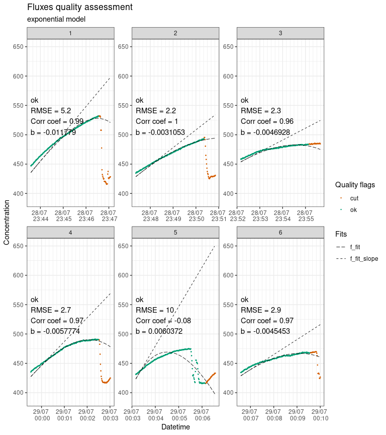

<!-- README.md is generated from README.Rmd. Please edit that file -->
<!-- # Fluxible -->

# fluxible <a href="https://plant-functional-trait-course.github.io/fluxible/index.html"></a>

<!-- badges: start -->

[](https://github.com/Plant-Functional-Trait-Course/fluxible/actions/workflows/R-CMD-check.yaml)
[](https://CRAN.R-project.org/package=fluxible)
[](https://lifecycle.r-lib.org/articles/stages.html#stable)
[](https://app.codecov.io/gh/Plant-Functional-Trait-Course/fluxible)
<!-- badges: end -->

The Fluxible R package is made to transform any dataset of gas
concentration over time into a gas flux dataset.
<!-- It was originally made to be used with a closed loop chamber system connected to a gas analyzer. -->
Thanks to its flexibility, it works for all kinds of setups (separated
files for each measurement vs continuous logging, variable vs constant
chamber volume, variable vs constant measurement length, …). It is
organized as a toolbox with one function per steps, which offers a lot
of freedom. If environmental data were recorded simultaneously
(photosynthetically active radiation, soil temperature, …), they can
also be processed (mean, sum or median), with the same focus window as
the flux estimate.

The goal of fluxible is to provide a workflow that removes individual
evaluation of each flux, reduces risk of bias, and makes it
reproducible. Users set specific data quality standards and selection
parameters as function arguments that are applied to the entire dataset.
Fluxible offers different methods to estimate fluxes: linear, quadratic,
exponential (Zhao *et al.*, 2018), and the original HM model (Hutchinson
and Mosier, 1981; Pedersen *et al.*, 2010). The kappamax method (Hüppi
*et al.*, 2018) is also included, at the quality control step. The
package runs the calculations automatically, without prompting the user
to take decisions mid-way, and provides quality flags and plots at the
end of the process for a visual check.

This makes it easy to use with large flux datasets and to integrate into
a reproducible and automated data processing pipeline such as the
[targets R package (Landau, 2021)](https://books.ropensci.org/targets/).
Using the Fluxible R package makes the workflow reproducible, increases
compatibility across studies, and is more time efficient.

For a visual overview of the package, see [the
poster](https://raw.githubusercontent.com/Plant-Functional-Trait-Course/fluxible/refs/heads/main/dissemination/poster_fluxible.pdf).

## Installation

Fluxible can be installed from CRAN.

``` r
install.packages("fluxible")
```

You can install the development version of fluxible from the [GitHub
repo](https://github.com/Plant-Functional-Trait-Course/fluxible) with:

``` r
# install.packages("devtools")
devtools::install_github("plant-functional-trait-course/fluxible")
```

## Short example

``` r
library(fluxible)

conc_df <- flux_match(
  co2_df_short,
  record_short,
  datetime,
  start,
  measurement_length = 220
)

slopes_df <- flux_fitting(
  conc_df,
  conc,
  datetime,
  fit_type = "exp_zhao18",
  end_cut = 60
)
#> Cutting measurements...
#> Estimating starting parameters for optimization...
#> Optimizing fitting parameters...
#> Calculating fits and slopes...
#> Done.

slopes_flag_df <- flux_quality(
  slopes_df,
  conc
)
#> 
#>  Total number of measurements: 6
#> 
#>  ok   6   100 %
#>  discard      0   0 %
#>  zero     0   0 %
#>  force_discard    0   0 %
#>  start_error      0   0 %
#>  no_data      0   0 %
#>  force_ok     0   0 %
#>  force_zero   0   0 %
#>  force_lm     0   0 %
#>  no_slope     0   0 %

flux_plot(
  slopes_flag_df,
  conc,
  datetime,
  f_ylim_lower = 390,
  f_ylim_upper = 650,
  facet_wrap_args = list(
    ncol = 3,
    nrow = 2,
    scales = "free"
  )
)
#> Plotting in progress
```

<div class="figure">


<p class="caption">
Output of flux_plot, showing fluxes plotted individually with
diagnostics and quality flags.
</p>

</div>

``` r

fluxes_df <- flux_calc(
  slopes_flag_df,
  f_slope_corr,
  datetime,
  temp_air,
  conc_unit = "ppm",
  flux_unit = "mmol/m2/h",
  cols_keep = c("turfID", "type"),
  cols_ave = c("temp_soil", "PAR"),
  setup_volume = 24.575,
  atm_pressure = 1,
  plot_area = 0.0625
)
#> Cutting data according to 'keep_arg'...
#> Averaging air temperature for each flux...
#> Creating a df with the columns from 'cols_keep' argument...
#> Creating a df with the columns from 'cols_ave' argument...
#> Calculating fluxes...
#> R constant set to 0.082057
#> Concentration was measured in ppm
#> Fluxes are in mmol/m2/h

fluxes_gpp <- flux_gpp(
  fluxes_df,
  type,
  datetime,
  id_cols = "turfID",
  cols_keep = c("temp_soil_ave")
)
#> Warning in flux_gpp(fluxes_df, type, datetime, id_cols = "turfID", cols_keep = c("temp_soil_ave")): 
#>  NEE missing for measurement turfID: 156 AN2C 156

fluxes_gpp
#> # A tibble: 9 × 5
#>   datetime            type  f_flux temp_soil_ave turfID      
#>   <dttm>              <chr>  <dbl>         <dbl> <chr>       
#> 1 2022-07-28 23:43:25 ER     51.9           10.9 156 AN2C 156
#> 2 2022-07-28 23:47:12 GPP     9.72          10.7 74 WN2C 155 
#> 3 2022-07-28 23:47:12 NEE    32.0           10.7 74 WN2C 155 
#> 4 2022-07-28 23:52:00 ER     22.3           10.7 74 WN2C 155 
#> 5 2022-07-28 23:59:22 GPP    -6.63          10.8 109 AN3C 109
#> 6 2022-07-28 23:59:22 NEE    44.3           10.8 109 AN3C 109
#> 7 2022-07-29 00:03:00 ER     50.9           10.5 109 AN3C 109
#> 8 2022-07-29 00:06:25 GPP    NA             12.2 29 WN3C 106 
#> 9 2022-07-29 00:06:25 NEE    32.7           12.2 29 WN3C 106
```

## Supporting infrastructure

### licoread R package

The [licoread R
package](https://jogaudard.github.io/licoread/index.html), developped in
collaboration with [LI-COR](https://www.licor.com/), provides an easy
way to import raw files from Li-COR gas analyzers as R objects that can
be used directly with the Fluxible R package.

## Further developments

### Segmentation tool

We are working on a tool to automatically select the window of the
measurement on which to fit a model. This selection will be based on
environmental variable, such as photosynthetically active radiation
(PAR), measured simultaneously.

### More fits

As we want fluxible to fit the use of as many projects as possible, more
fitting expressions will be included in the flux_fitting function. Feel
welcome to get in touch if you wish to include yours in fluxible.

## Contact

[Joseph Gaudard](https://jogaudard.github.io/CV_jgaudard/), University
of Bergen, Norway

<joseph.gaudard@pm.me>

[GitHub page](https://github.com/jogaudard)

## Dissemination

If you are running a course and want to talk about Fluxible, feel free
to use this [two-slides
presentation](https://raw.githubusercontent.com/Plant-Functional-Trait-Course/fluxible/refs/heads/main/dissemination/fluxible_jgaudard_short.pdf).
Of course, you can always reach out if you wish to have more material.

Gaudard J, Chacon-Labella J, Dawson HR, Enquist B, Telford RJ, Töpper
JP, Trepel J, Vandvik V, Baumane M, Birkeli K, Holle MJM, Hupp JR,
Santos-Andrade PE, Satriawan TW, Halbritter AH. “Fluxible: an R package
to process ecosystem gas fluxes from closed-loop chambers in an
automated and reproducible way.” Authorea Preprints.
[doi:10.22541/au.175071021.14153294/v1](https://doi.org/10.22541/au.175071021.14153294/v1),
2025.

Gaudard J, Trepel J, Dawson HR, Enquist B, Halbritter AH, Mustri M,
Niittynen P, Santos-Andrade PE, Topper JP, Vandvik V, and Telford RJ.
“Fluxible: an R package to calculate ecosystem gas fluxes from closed
loop chamber systems in a reproducible and automated workflow”
([slides](https://raw.githubusercontent.com/Plant-Functional-Trait-Course/fluxible/refs/heads/main/dissemination/fluxible_jgaudard_EGU25.pdf)),
EGU General Assembly 2025, Vienna, Austria, 27 Apr–2 May 2025,
EGU25-12409,
[doi:10.5194/egusphere-egu25-12409](https://doi.org/10.5194/egusphere-egu25-12409),
2025.

Gaudard J, Telford R, Vandvik V, and Halbritter AH: “Fluxible: an R
package to calculate ecosystem gas fluxes in a reproducible and
automated workflow”
([poster](https://raw.githubusercontent.com/Plant-Functional-Trait-Course/fluxible/refs/heads/main/dissemination/poster_fluxible.pdf)),
EGU General Assembly 2024, Vienna, Austria, 14–19 Apr 2024, EGU24-956,
[doi:10.5194/egusphere-egu24-956](https://doi.org/10.5194/egusphere-egu24-956),
2024.

<!-- [Direct link to the poster](https://github.com/Plant-Functional-Trait-Course/fluxible/blob/main/dissemination/poster_EGU24_jgaudard.pdf) -->
<!-- [Link to the abstract](https://meetingorganizer.copernicus.org/EGU24/EGU24-956.html) -->

## Acknowledgements

Fluxible builds on the earlier effort from the Plant Functional Traits
Course Community
[co2fluxtent](https://github.com/PaulESantos/co2fluxtent) (Brummer *et
al.*, 2023).

#### References

<div id="refs" class="references csl-bib-body hanging-indent"
entry-spacing="0" line-spacing="2">

<div id="ref-co2fluxtent" class="csl-entry">

Brummer, A.B., Enquist, B.J. and Santos-Andrade, P.E. (2023),
*Co2fluxtent: Tools for NEE and ET Fitting from CO2 Flux*, Manual,.

</div>

<div id="ref-huppiRestrictingNonlinearityParameter2018"
class="csl-entry">

Hüppi, R., Felber, R., Krauss, M., Six, J., Leifeld, J. and Fuß, R.
(2018), “[Restricting the nonlinearity parameter in soil greenhouse gas
flux calculation for more reliable flux
estimates](https://doi.org/10.1371/journal.pone.0200876)”, *PLOS ONE*,
Public Library of Science, Vol. 13 No. 7, p. e0200876.

</div>

<div id="ref-hutchinsonImprovedSoilCover1981" class="csl-entry">

Hutchinson, G.L. and Mosier, A.R. (1981), “[Improved Soil Cover Method
for Field Measurement of Nitrous Oxide
Fluxes](https://doi.org/10.2136/sssaj1981.03615995004500020017x)”, *Soil
Science Society of America Journal*, Vol. 45 No. 2, pp. 311–316.

</div>

<div id="ref-targetsRpackage2021" class="csl-entry">

Landau, W.M. (2021), “[The targets R package: A dynamic
<span class="nocase">Make-like</span> function-oriented pipeline toolkit
for reproducibility and high-performance
computing](https://doi.org/10.21105/joss.02959)”, *Journal of Open
Source Software*, Vol. 6 No. 57, p. 2959.

</div>

<div id="ref-pedersenComprehensiveApproachSoilatmosphere2010a"
class="csl-entry">

Pedersen, A.R., Petersen, S.O. and Schelde, K. (2010), “[A comprehensive
approach to soil-atmosphere trace-gas flux estimation with static
chambers](https://doi.org/10.1111/j.1365-2389.2010.01291.x)”, *European
Journal of Soil Science*, Vol. 61 No. 6, pp. 888–902.

</div>

<div id="ref-zhaoCalculationDaytimeCO22018" class="csl-entry">

Zhao, P., Hammerle, A., Zeeman, M. and Wohlfahrt, G. (2018), “[On the
calculation of daytime CO2 fluxes measured by automated closed
transparent chambers](https://doi.org/10.1016/j.agrformet.2018.08.022)”,
*Agricultural and Forest Meteorology*, Vol. 263, pp. 267–275.

</div>

</div>
