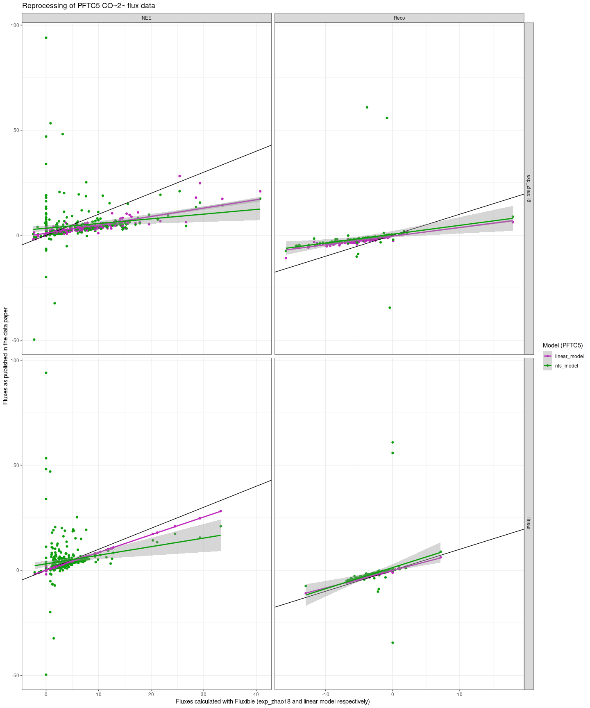
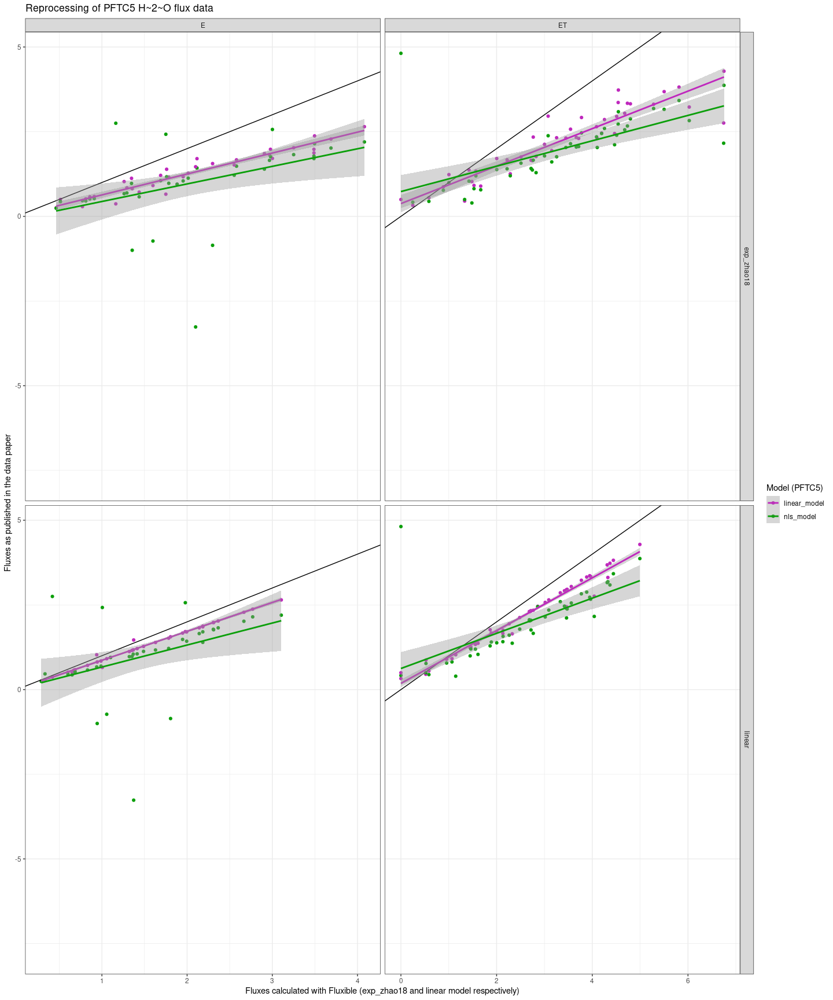

Using fluxible with the Li7500
================

This vignette aims at reproducing the ecosystem fluxes (CO<sub>2</sub>
and H<sub>2</sub>O) processing presented in
@halbritterPlantTraitVegetation2024. It also acts as an example on how
to use fluxible with the LI-7500 open path setup, and how to reprocess
data that were collected with a different processing method in mind.

# Importing and reading the files

First, we import the data from OSF with `dataDownloader::get_file`.

``` r
library(dataDownloader)

get_file("gs8u6",
         "rawData/raw_c-flux",
         "rawC-flux.zip",
         "ex_data/li7500")

unzip("ex_data/li7500/rawC-flux.zip",
      exdir = "ex_data/li7500/rawC-flux")
```

Then we import the data with `licoread::import7500`.

``` r
library(licoread)
library(tidyverse)
pftc5_data_raw <- import7500(
  "ex_data/li7500/rawC-flux/rawData/raw_tent-flux",
  plotinfo_names = c("site", "treatment", "date", "plot_id", "trial")
)
```

<!-- The `licoread::import7500` function provides `f_fluxid`, `f_start` and `f_end`, meaning we could skip `fluxible::flux_match`. -->

The `licoread::import7500` function provides `file_start` and
`file_end`, and `filename` as a unique measurement identifier, meaning
we could skip `fluxible::flux_match`. However, `file_start` and
`file_end` are based on the start and end of the files, which would
require a strict data collection routine, which was not done there
(because there was no original plans to use fluxible since it did not
exist). The strategy will be to recreate the `field_record` input. We
can use the `t_start` and `t_finish` columns in the clean data for that,
since they correspond to the cuts the team decided to apply. Note that
this is also an example of how fluxible can be used to process data in a
non homogenous way, would that be necessary.

``` r

# downloading clean data
get_file("gs8u6",
         "c-flux",
         "PFTC3_Puna_PFTC5_Peru_2018_2020_Cflux.csv",
         "ex_data/li7500")
#> 'PFTC3_Puna_PFTC5_Peru_2018_2020_Cflux.csv' downloaded succesfully

pftc5_published_fluxes_co2 <- read_csv(
  "ex_data/li7500/PFTC3_Puna_PFTC5_Peru_2018_2020_Cflux.csv",
  show_col_types = FALSE # quiet!
)

pftc5_published_fluxes_co2 <- pftc5_published_fluxes_co2 |>
  mutate(
    date = ymd(paste(year, month, day)),
    replicate = case_when(
      flux == "Reco" ~ 1,
      flux == "NEE" ~ 1,
      flux == "NEE1" ~ 2,
      flux == "NEE2" ~ 3,
      flux == "NEE3" ~ 4
    ),
    flux = case_when(
      flux == "Reco" ~ "Reco",
      flux == "NEE" ~ "NEE",
      flux == "NEE1" ~ "NEE",
      flux == "NEE2" ~ "NEE",
      flux == "NEE3" ~ "NEE"
    )
  )

# normally the same cuts should have been applied to CO2 and H2O
pftc5_cuts <- pftc5_published_fluxes_co2 |>
  select(date, flux, replicate, site, treatment, plot_id, t_start, t_finish)

# t_start and t_finish are relative time
# we need to fetch datetime from the raw data

pftc5_record <- pftc5_data_raw |>
  mutate(
    plot_id = as.integer(str_extract(plot_id, "\\d+")),
    flux = case_when(
      trial == "r" ~ "Reco",
      trial == "p" ~ "NEE",
      trial == "p1" ~ "NEE",
      trial == "p2" ~ "NEE",
      trial == "p3" ~ "NEE"
    ),
    replicate = case_when(
      trial == "r" ~ 1,
      trial == "p" ~ 1,
      trial == "p1" ~ 2,
      trial == "p2" ~ 3,
      trial == "p3" ~ 4
    ),
    date = as_date(f_datetime)
  ) |>
  select(file_start, date, flux, site, treatment, plot_id, replicate) |>
  distinct() |>
  drop_na(flux) |>
  left_join(pftc5_cuts,
            by = join_by(date, flux, site, treatment, plot_id, replicate)) |>
  mutate(
    start = file_start + t_start,
    end = file_start + t_finish
  ) |>
  select(!c(file_start, t_start, t_finish)) |> # to avoid confusion
  arrange(start)

# Now the meta data are in pftc5_record,
# we remove them from pftc5_data to avoid confusion
# flux match crashes if columns are both in raw data and record
# this will be corrected in next version

pftc5_data <- pftc5_data_raw |>
  select(!c(site, treatment, plot_id, trial, date))
```

Would that be necessary to process fluxes in a non homogenous way
(manual cutting after visualization), the procedure would go as follow:

- use start and end from `licoread::import7500`
- process fluxes until visualization (`flux_fitting`, `flux_quality` and
  `flux_plot`)
- based on the plots, create a `record` file with metadata identifying
  the fluxes (`filename`), start and end (note that `flux_match`
  requires datetime format)
- include `flux_match` before `flux_fitting` in your workflow, and match
  the fluxes with the record file created
- adapt the record file if necessary and rerun until `flux_plot`
- once satisfied with cutting and fitting, run `flux_calc` as normally

# Processing with fluxible

<!-- Since the `licoread::import7500` already provides `f_fluxid`, `f_start` and `f_end`, we can skip `fluxible::flux_match` and directly fit with `fluxible::flux_fitting`. -->

We will fit both the linear and exponential model for comparison
purpose.

``` r
library(fluxible)
pftc5_match <- flux_match(pftc5_data,
                          pftc5_record,
                          f_datetime = f_datetime,
                          start_col = start,
                          end_col = end)
```

## CO<sub>2</sub>

Wet air correction:

``` r
pftc5_match <- flux_drygas(pftc5_match, `CO2 umol/mol`, `H2O mmol/mol`)
```

### Exponential model

Fitting the model presented in @zhaoCalculationDaytimeCO22018.

``` r
pftc5_fits_exp_co2 <- flux_fitting(pftc5_match,
                                   f_conc = `CO2 umol/mol_dry`,
                                   fit_type = "exp_zhao18",
                                   start_cut = 0,
                                   end_cut = 0)
```

Using `fluxible::flux_quality` to assess the quality of the dataset.

``` r
pftc5_flags_exp_co2 <- flux_quality(pftc5_fits_exp_co2,
                                    f_conc = `CO2 umol/mol_dry`,
                                    rsquared_threshold = 0.5)
#> 
#>  Total number of measurements: 609
#> 
#>  ok   441     72 %
#>  zero     83      14 %
#>  start_error      81      13 %
#>  discard      4   1 %
#>  force_discard    0   0 %
#>  no_data      0   0 %
#>  force_ok     0   0 %
#>  force_zero   0   0 %
#>  force_lm     0   0 %
#>  no_slope     0   0 %
```

Then plotting (in an external file) for a visual check. Because of the
number of data, we will do it per site to make it lighter.

``` r
pftc5_flags_exp_co2 |>
  dplyr::filter(site == "ACJ") |>
  flux_plot(f_conc = `CO2 umol/mol_dry`,
            print_plot = FALSE,
            output = "longpdf",
            f_plotname = "ACJ_plot_exp_co2")

pftc5_flags_exp_co2 |>
  dplyr::filter(site == "PIL") |>
  flux_plot(f_conc = `CO2 umol/mol_dry`,
            print_plot = FALSE,
            output = "longpdf",
            f_plotname = "PIL_plot_exp_co2")

pftc5_flags_exp_co2 |>
  dplyr::filter(site == "QUE") |>
  flux_plot(f_conc = `CO2 umol/mol_dry`,
            print_plot = FALSE,
            output = "longpdf",
            f_plotname = "QUE_plot_exp_co2")

pftc5_flags_exp_co2 |>
  dplyr::filter(site == "TRE") |>
  flux_plot(f_conc = `CO2 umol/mol_dry`,
            print_plot = FALSE,
            output = "longpdf",
            f_plotname = "TRE_plot_exp_co2")

pftc5_flags_exp_co2 |>
  dplyr::filter(site == "WAY") |>
  flux_plot(f_conc = `CO2 umol/mol_dry`,
            print_plot = FALSE,
            output = "longpdf",
            f_plotname = "WAY_plot_exp_co2")

pftc5_flags_exp_co2 |>
  dplyr::filter(f_quality_flag == "zero") |>
  flux_plot(f_conc = `CO2 umol/mol_dry`,
            print_plot = FALSE,
            output = "longpdf",
            f_ylim_upper = 500,
            f_ylim_lower = 350,
            y_text_position = 450,
            f_plotname = "zero_plot_exp_co2")
```

If other data (PAR and co) need cleaning, that would happen here. To
“compress” environmental variables at a single value per flux, see the
arguments `cols_ave`, `cols_sum`, and `cols_med` in
`fluxible::flux_calc`. To keep the raw data (gas concentration or
anything else) in a nested column, see the `cols_nest` argument.

Now let’s calculate the fluxes with `fluxible::flux_calc`.

``` r
pftc5_fluxes_exp_co2 <- flux_calc(pftc5_flags_exp_co2,
                                  slope_col = f_slope_corr,
                                  temp_air_col = Temperature,
                                  setup_volume = 2197,
                                  atm_pressure = pressure_atm,
                                  plot_area = 1.44,
                                  conc_unit = "ppm",
                                  flux_unit = "umol/m2/s",
                                  cols_keep = c(
                                    "site", "treatment", "date", "plot_id",
                                    "flux", "replicate"
                                  ))
#> Cutting data according to 'keep_arg'...
#> Averaging air temperature for each flux...
#> Creating a df with the columns from 'cols_keep' argument...
#> Calculating fluxes...
#> R constant set to 0.082057
#> Concentration was measured in ppm
#> Fluxes are in umol/m2/s
```

### Linear model

Fitting a linar model:

``` r
pftc5_fits_lm_co2 <- flux_fitting(pftc5_match,
                                  f_conc = `CO2 umol/mol_dry`,
                                  fit_type = "linear",
                                  start_cut = 0,
                                  end_cut = 0)
```

Using `fluxible::flux_quality` to assess the quality of the dataset:

``` r
pftc5_flags_lm_co2 <- flux_quality(pftc5_fits_lm_co2,
                                   f_conc = `CO2 umol/mol_dry`,
                                   rsquared_threshold = 0.5)
#> 
#>  Total number of measurements: 609
#> 
#>  ok   486     80 %
#>  start_error      81      13 %
#>  zero     39      6 %
#>  discard      3   0 %
#>  force_discard    0   0 %
#>  no_data      0   0 %
#>  force_ok     0   0 %
#>  force_zero   0   0 %
#>  force_lm     0   0 %
#>  no_slope     0   0 %
```

Then plotting (in an external file) for a visual check:

``` r
pftc5_flags_lm_co2 |>
  dplyr::filter(site == "ACJ") |>
  flux_plot(f_conc = `CO2 umol/mol_dry`,
            print_plot = FALSE,
            output = "longpdf",
            f_plotname = "ACJ_plot_lm_co2")

pftc5_flags_lm_co2 |>
  dplyr::filter(site == "PIL") |>
  flux_plot(f_conc = `CO2 umol/mol_dry`,
            print_plot = FALSE,
            output = "longpdf",
            f_plotname = "PIL_plot_lm_co2")

pftc5_flags_lm_co2 |>
  dplyr::filter(site == "QUE") |>
  flux_plot(f_conc = `CO2 umol/mol_dry`,
            print_plot = FALSE,
            output = "longpdf",
            f_plotname = "QUE_plot_lm_co2")

pftc5_flags_lm_co2 |>
  dplyr::filter(site == "TRE") |>
  flux_plot(f_conc = `CO2 umol/mol_dry`,
            print_plot = FALSE,
            output = "longpdf",
            f_plotname = "TRE_plot_lm_co2")

pftc5_flags_lm_co2 |>
  dplyr::filter(site == "WAY") |>
  flux_plot(f_conc = `CO2 umol/mol_dry`,
            print_plot = FALSE,
            output = "longpdf",
            f_plotname = "WAY_plot_lm_co2")

pftc5_flags_lm_co2 |>
  dplyr::filter(f_quality_flag == "zero") |>
  flux_plot(f_conc = `CO2 umol/mol_dry`,
            print_plot = FALSE,
            output = "longpdf",
            f_ylim_upper = 500,
            f_ylim_lower = 350,
            y_text_position = 450,
            f_plotname = "zero_plot_lm_co2")
```

Flux calculation:

``` r
pftc5_fluxes_lm_co2 <- flux_calc(pftc5_flags_lm_co2,
                                 slope_col = f_slope_corr,
                                 temp_air_col = Temperature,
                                 setup_volume = 2197,
                                 atm_pressure = pressure_atm,
                                 plot_area = 1.44,
                                 conc_unit = "ppm",
                                 flux_unit = "umol/m2/s",
                                 cols_keep = c(
                                   "site", "treatment", "date", "plot_id",
                                   "flux", "replicate"
                                 ))
#> Cutting data according to 'keep_arg'...
#> Averaging air temperature for each flux...
#> Creating a df with the columns from 'cols_keep' argument...
#> Calculating fluxes...
#> R constant set to 0.082057
#> Concentration was measured in ppm
#> Fluxes are in umol/m2/s
```

## H<sub>2</sub>O

We need to change the denomination of the fluxes, because now we work
with H<sub>2</sub>O. Other than that, it is the same procedure and the
same functions.

``` r
pftc5_match_h2o <- pftc5_match |>
  mutate(
    flux = str_replace_all(flux, c(
      "NEE" = "ET",
      "Reco" = "E"
    ))
  )
```

Wet air correction:

``` r
pftc5_match_h2o <- flux_drygas(pftc5_match_h2o, `H2O mmol/mol`, `H2O mmol/mol`)
```

### Exponential model

Fitting the model presented in @zhaoCalculationDaytimeCO22018.

``` r
pftc5_fits_exp_h2o <- flux_fitting(pftc5_match_h2o,
                                   f_conc = `H2O mmol/mol_dry`,
                                   fit_type = "exp_zhao18",
                                   start_cut = 0,
                                   end_cut = 0)
```

Using `fluxible::flux_quality` to assess the quality of the dataset:

``` r
pftc5_flags_exp_h2o <- flux_quality(pftc5_fits_exp_h2o,
                                    f_conc = `H2O mmol/mol_dry`,
                                    rsquared_threshold = 0.5,
                                    ambient_conc = 40, # the default is for CO2
                                    error = 20)
#> 
#>  Total number of measurements: 609
#> 
#>  start_error      526     86 %
#>  ok   79      13 %
#>  discard      3   0 %
#>  zero     1   0 %
#>  force_discard    0   0 %
#>  no_data      0   0 %
#>  force_ok     0   0 %
#>  force_zero   0   0 %
#>  force_lm     0   0 %
#>  no_slope     0   0 %
```

Then plotting (in an external file) for a visual check:

``` r
pftc5_flags_exp_h2o |>
  dplyr::filter(site == "ACJ") |>
  flux_plot(f_conc = `H2O mmol/mol_dry`,
            print_plot = FALSE,
            output = "longpdf",
            f_plotname = "ACJ_plot_exp_h2o")

pftc5_flags_exp_h2o |>
  dplyr::filter(site == "PIL") |>
  flux_plot(f_conc = `H2O mmol/mol_dry`,
            print_plot = FALSE,
            output = "longpdf",
            f_plotname = "PIL_plot_exp_h2o")

pftc5_flags_exp_h2o |>
  dplyr::filter(site == "QUE") |>
  flux_plot(f_conc = `H2O mmol/mol_dry`,
            print_plot = FALSE,
            output = "longpdf",
            f_plotname = "QUE_plot_exp_h2o")

pftc5_flags_exp_h2o |>
  dplyr::filter(site == "TRE") |>
  flux_plot(f_conc = `H2O mmol/mol_dry`,
            print_plot = FALSE,
            output = "longpdf",
            f_plotname = "TRE_plot_exp_h2o")

pftc5_flags_exp_h2o |>
  dplyr::filter(site == "WAY") |>
  flux_plot(f_conc = `H2O mmol/mol_dry`,
            print_plot = FALSE,
            output = "longpdf",
            f_plotname = "WAY_plot_exp_h2o")

pftc5_flags_exp_h2o |>
  dplyr::filter(f_quality_flag == "zero") |>
  flux_plot(f_conc = `H2O mmol/mol_dry`,
            print_plot = FALSE,
            output = "longpdf",
            f_ylim_upper = 500,
            f_ylim_lower = 350,
            y_text_position = 450,
            f_plotname = "zero_plot_exp_h2o")
```

Flux calculations:

``` r
pftc5_fluxes_exp_h2o <- flux_calc(pftc5_flags_exp_h2o,
                                  slope_col = f_slope_corr,
                                  temp_air_col = Temperature,
                                  setup_volume = 2197,
                                  atm_pressure = pressure_atm,
                                  plot_area = 1.44,
                                  conc_unit = "mmol/mol",
                                  flux_unit = "mmol/m2/s",
                                  cols_keep = c(
                                    "site", "treatment", "date", "plot_id",
                                    "flux", "replicate"
                                  ))
#> Cutting data according to 'keep_arg'...
#> Averaging air temperature for each flux...
#> Creating a df with the columns from 'cols_keep' argument...
#> Calculating fluxes...
#> R constant set to 0.082057
#> Concentration was measured in mmol/mol
#> Fluxes are in mmol/m2/s
```

### Linear model

Fitting a linar model:

``` r
pftc5_fits_lm_h2o <- flux_fitting(pftc5_match_h2o,
                                  f_conc = `H2O mmol/mol_dry`,
                                  fit_type = "linear",
                                  start_cut = 0,
                                  end_cut = 0)
```

Using `fluxible::flux_quality` to assess the quality of the dataset:

``` r
pftc5_flags_lm_h2o <- flux_quality(pftc5_fits_lm_h2o,
                                   f_conc = `H2O mmol/mol_dry`,
                                   rsquared_threshold = 0.5,
                                   ambient_conc = 40, # the default is for CO2
                                   error = 20)
#> 
#>  Total number of measurements: 609
#> 
#>  start_error      526     86 %
#>  ok   78      13 %
#>  discard      3   0 %
#>  zero     2   0 %
#>  force_discard    0   0 %
#>  no_data      0   0 %
#>  force_ok     0   0 %
#>  force_zero   0   0 %
#>  force_lm     0   0 %
#>  no_slope     0   0 %
```

Then plotting (in an external file) for a visual check:

``` r
pftc5_flags_lm_h2o |>
  dplyr::filter(site == "ACJ") |>
  flux_plot(f_conc = `H2O mmol/mol_dry`,
            print_plot = FALSE,
            output = "longpdf",
            f_plotname = "ACJ_plot_lm_h2o")

pftc5_flags_lm_h2o |>
  dplyr::filter(site == "PIL") |>
  flux_plot(f_conc = `H2O mmol/mol_dry`,
            print_plot = FALSE,
            output = "longpdf",
            f_plotname = "PIL_plot_lm_h2o")

pftc5_flags_lm_h2o |>
  dplyr::filter(site == "QUE") |>
  flux_plot(f_conc = `H2O mmol/mol_dry`,
            print_plot = FALSE,
            output = "longpdf",
            f_plotname = "QUE_plot_lm_h2o")

pftc5_flags_lm_h2o |>
  dplyr::filter(site == "TRE") |>
  flux_plot(f_conc = `H2O mmol/mol_dry`,
            print_plot = FALSE,
            output = "longpdf",
            f_plotname = "TRE_plot_lm_h2o")

pftc5_flags_lm_h2o |>
  dplyr::filter(site == "WAY") |>
  flux_plot(f_conc = `H2O mmol/mol_dry`,
            print_plot = FALSE,
            output = "longpdf",
            f_plotname = "WAY_plot_lm_h2o")

pftc5_flags_lm_h2o |>
  dplyr::filter(f_quality_flag == "zero") |>
  flux_plot(f_conc = `H2O mmol/mol_dry`,
            print_plot = FALSE,
            output = "longpdf",
            f_ylim_upper = 500,
            f_ylim_lower = 350,
            y_text_position = 450,
            f_plotname = "zero_plot_lm_h2o")
```

Flux calculations:

``` r
pftc5_fluxes_lm_h2o <- flux_calc(pftc5_flags_lm_h2o,
                                 slope_col = f_slope_corr,
                                 temp_air_col = Temperature,
                                 setup_volume = 2197,
                                 atm_pressure = pressure_atm,
                                 plot_area = 1.44,
                                 conc_unit = "mmol/mol",
                                 flux_unit = "mmol/m2/s",
                                 cols_keep = c(
                                   "site", "treatment", "date", "plot_id",
                                   "flux", "replicate"
                                 ))
#> Cutting data according to 'keep_arg'...
#> Averaging air temperature for each flux...
#> Creating a df with the columns from 'cols_keep' argument...
#> Calculating fluxes...
#> R constant set to 0.082057
#> Concentration was measured in mmol/mol
#> Fluxes are in mmol/m2/s
```

# Calculating Gross Primary Production and Transpiration

I’m glad you asked! The function `fluxible::flux_diff` is precisely made
for that.

``` r
pftc5_fluxes_lm_co2 <- flux_diff(pftc5_fluxes_lm_co2, type_col = flux,
                                 id_cols = c(
                                   "site", "treatment", "date",
                                   "plot_id", "replicate"
                                 ), type_a = "NEE", type_b = "Reco",
                                 diff_name = "GPP", cols_keep = "all")
```

``` r
pftc5_fluxes_lm_h2o <- flux_diff(pftc5_fluxes_lm_h2o, type_col = flux,
                                 id_cols = c(
                                   "site", "treatment", "date",
                                   "plot_id", "replicate"
                                 ), type_a = "ET", type_b = "E",
                                 diff_name = "T", cols_keep = "all")
```

# Comparison

## CO<sub>2</sub>

Let’s format the fluxible fluxes in a similar way.

``` r
pftc5_fluxible_fluxes_co2 <- pftc5_fluxes_exp_co2 |>
  bind_rows(pftc5_fluxes_lm_co2) |>
  mutate(
    fluxible_flux = -f_flux # the opposite convention was used for PFTC5
  ) |>
  drop_na(flux) # removing amb measurements
```

<!-- Now download and format PFTC5 fluxes. -->
<!-- In the clean data on OSF, both linear and nls fluxes are available.
Which one to choose is not explicit (but I am tired, do not quote me on that), so we will just take the one with the lowest aic for now. -->

``` r


pftc5_published_fluxes_co2 <- pftc5_published_fluxes_co2 |>
  pivot_longer(
    c(linear_model, nls_model),
    values_to = "published_fluxes",
    names_to = "model"
  )
```

Putting them together:

``` r
pftc5_fluxes_comparison_co2 <- left_join(pftc5_published_fluxes_co2,
                                         pftc5_fluxible_fluxes_co2,
                                         by = join_by(date, flux,
                                                      site, treatment,
                                                      plot_id, replicate),
                                         relationship = "many-to-many")
```

<figure>

<figcaption aria-hidden="true">Comparison of CO2 fluxes calculated with
fluxible and published in Halbritter et al (2024).</figcaption>
</figure>

## H<sub>2</sub>O

Let’s format the fluxible fluxes in a similar way.

``` r
pftc5_fluxible_fluxes_h2o <- pftc5_fluxes_exp_h2o |>
  bind_rows(pftc5_fluxes_lm_h2o) |>
  rename(
    fluxible_flux = "f_flux"
  ) |>
  drop_na(flux) # removing amb measurements
```

<!-- Now download and format PFTC5 fluxes. -->
<!-- In the clean data on OSF, both linear and nls fluxes are available.
Which one to choose is not explicit (but I am tired, do not quote me on that), so we will just take the one with the lowest aic for now. -->

Importing the published dataset:

``` r

get_file("gs8u6",
         "c-flux",
         "PFTC3_Puna_PFTC5_Peru_2018_2020_wflux.csv",
         "ex_data/li7500")
#> 'PFTC3_Puna_PFTC5_Peru_2018_2020_wflux.csv' downloaded succesfully

pftc5_published_fluxes_h2o <- read_csv(
  "ex_data/li7500/PFTC3_Puna_PFTC5_Peru_2018_2020_wflux.csv",
  show_col_types = FALSE # quiet!
)

pftc5_published_fluxes_h2o <- pftc5_published_fluxes_h2o |>
  mutate(
    date = ymd(paste(year, month, day)),
    replicate = case_when(
      flux == "E" ~ 1,
      flux == "ET" ~ 1,
      flux == "ET1" ~ 2,
      flux == "ET2" ~ 3,
      flux == "ET3" ~ 4
    ),
    flux = case_when(
      flux == "E" ~ "E",
      flux == "ET" ~ "ET",
      flux == "ET1" ~ "ET",
      flux == "ET2" ~ "ET",
      flux == "ET3" ~ "ET"
    )
  )

pftc5_published_fluxes_h2o <- pftc5_published_fluxes_h2o |>
  pivot_longer(
    c(linear_model, nls_model),
    values_to = "published_fluxes",
    names_to = "model"
  )
```

Putting them together:

``` r
pftc5_fluxes_comparison_h2o <- left_join(pftc5_published_fluxes_h2o,
                                         pftc5_fluxible_fluxes_h2o,
                                         by = join_by(date, flux,
                                                      site, treatment,
                                                      plot_id, replicate),
                                         relationship = "many-to-many")
```

<figure>

<figcaption aria-hidden="true">Comparison of H<sub>2</sub>O fluxes
calculated with fluxible and published in Halbritter et al
(2024).</figcaption>
</figure>

## Possible explanation for the differences

- Since the nls_model is an exponential model without linear term, it
  gives unrealistic estimates when fitted to a flux that has no
  curvature \[@huppiRestrictingNonlinearityParameter2018;
  @pedersenComprehensiveApproachSoilatmosphere2010a\]. Fluxible solves
  this issue by using the model presented in
  @zhaoCalculationDaytimeCO22018, which is also an exponential but
  contains a linear term allowing it to fit linear data.
- The fluxes with hight published values and zero with fluxible are good
  examples of the behaviour of the nls model with linear data. Looking
  at the plot, it is evident that those fluxes are close to zero. In
  fluxible, they get flagged for as “bad fit”, but since there is no
  change of concentration over time they get replaced by zero instead of
  getting discarded.
- Possible explanation for the over estimation of the exponential model
  in fluxible compared to the linear model can be found in
  @kutzbachCO2FluxDetermination2007 .
- At this point I don’t have a hypothesis for the slight over estimation
  with fluxible when using a linear model.

### References
