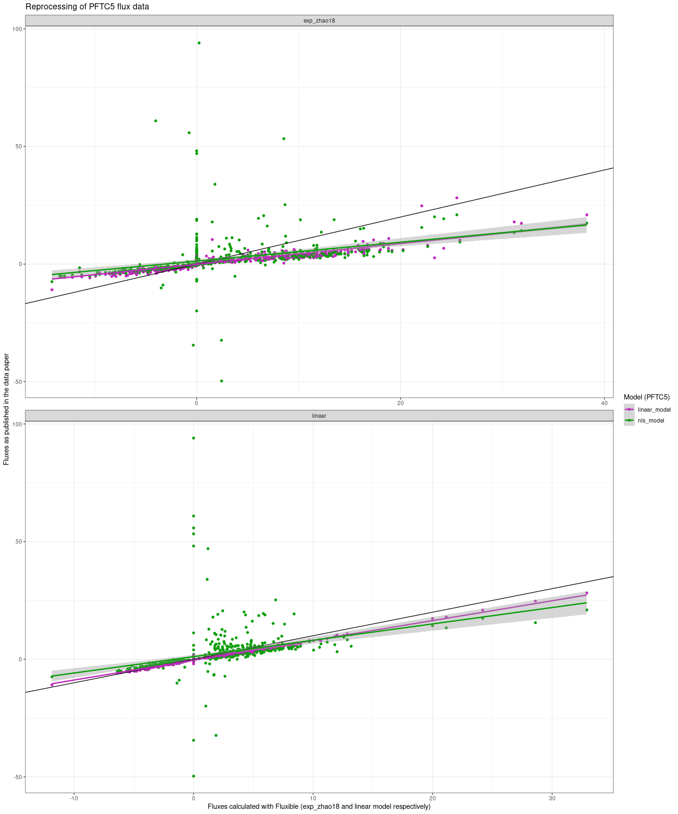

Using fluxible with the Li7500
================

In this vignette, we will see how to read the data from the setup
described in @halbritterPlantTraitVegetation2024 and compare the output
calculated with fluxible with the published data.

The code used to import the data might be turned into a package later.

## Importing and reading the files

First, we import the data from OSF with `dataDownloader::get_file`.

``` r
library(dataDownloader)

get_file("gs8u6",
         "rawData/raw_c-flux",
         "rawC-flux.zip",
         "vignettes/ex_data/li7500")
#> rawC-flux.zip already up to date.

unzip("vignettes/ex_data/li7500/rawC-flux.zip",
      exdir = "vignettes/ex_data/li7500/rawC-flux")
```

Then we import the data with `licoread::import7500`.

``` r
library(licoread)
library(tidyverse)
pftc5_data <- import7500(
  "vignettes/ex_data/li7500/rawC-flux/rawData/raw_tent-flux",
  plotinfo_names = c("site", "treatment", "date", "plot_id", "trial")
)
#>  ■■■■■■■                           20% |  ETA:  9s
#>  ■■■■■■■■■■■■■■                    44% |  ETA:  7s
#>  ■■■■■■■■■■■■■■■■■■■               60% |  ETA:  6s
#>  ■■■■■■■■■■■■■■■■■■■■■■■■■         81% |  ETA:  3s

# a try to mimic the cuts done in PFTC5
# pftc5_data <- pftc5_data |>
#   mutate(
#     f_end = f_start + 120
#   )
```

## Processing with fluxible

Since the `licoread::import7500` already provides `f_fluxid`, `f_start`
and `f_end`, we can skip `fluxible::flux_match` and directly fit with
`fluxible::flux_fitting`.

``` r
library(fluxible)
pftc5_fits <- flux_fitting(pftc5_data,
                           f_conc = `CO2 umol/mol`,
                           fit_type = "exp_zhao18",
                           start_cut = 0,
                           end_cut = 0)
```

Using `fluxible::flux_quality` to assess the quality of the dataset.

``` r
pftc5_flags <- flux_quality(pftc5_fits,
                            f_conc = `CO2 umol/mol`,
                            rsquared_threshold = 0.5)
#> 
#>  Total number of measurements: 830
#> 
#>  ok   598     72 %
#>  start_error      122     15 %
#>  zero     100     12 %
#>  discard      10      1 %
#>  force_discard    0   0 %
#>  no_data      0   0 %
#>  force_ok     0   0 %
#>  force_zero   0   0 %
#>  force_lm     0   0 %
#>  no_slope     0   0 %
```

Then plotting (in an external file) for a visual check. Because of the
number of data, we will do it per site to make it lighter.

``` r
pftc5_flags |>
  dplyr::filter(site == "ACJ") |>
  flux_plot(f_conc = `CO2 umol/mol`,
            print_plot = FALSE,
            output = "longpdf",
            f_plotname = "ACJ_plot")

pftc5_flags |>
  dplyr::filter(site == "PIL") |>
  flux_plot(f_conc = `CO2 umol/mol`,
            print_plot = FALSE,
            output = "longpdf",
            f_plotname = "PIL_plot")

pftc5_flags |>
  dplyr::filter(site == "QUE") |>
  flux_plot(f_conc = `CO2 umol/mol`,
            print_plot = FALSE,
            output = "longpdf",
            f_plotname = "QUE_plot")

pftc5_flags |>
  dplyr::filter(site == "TRE") |>
  flux_plot(f_conc = `CO2 umol/mol`,
            print_plot = FALSE,
            output = "longpdf",
            f_plotname = "TRE_plot")

pftc5_flags |>
  dplyr::filter(site == "WAY") |>
  flux_plot(f_conc = `CO2 umol/mol`,
            print_plot = FALSE,
            output = "longpdf",
            f_plotname = "WAY_plot")

pftc5_flags |>
  dplyr::filter(f_quality_flag == "zero") |>
  flux_plot(f_conc = `CO2 umol/mol`,
            print_plot = FALSE,
            output = "longpdf",
            f_ylim_upper = 500,
            f_ylim_lower = 350,
            y_text_position = 450,
            f_plotname = "zero_plot")
```

Now let’s calculate the fluxes with `fluxible::flux_calc`.

``` r
pftc5_fluxes <- flux_calc(pftc5_flags,
                          slope_col = f_slope_corr,
                          temp_air_col = Temperature,
                          setup_volume = 2197,
                          atm_pressure = pressure_atm,
                          plot_area = 1.44,
                          conc_unit = "ppm",
                          flux_unit = "umol/m2/s",
                          cols_keep = c(
                            "site", "treatment", "date", "plot_id", "trial"
                          ))
#> Cutting data according to 'keep_arg'...
#> Averaging air temperature for each flux...
#> Creating a df with the columns from 'cols_keep' argument...
#> Calculating fluxes...
#> R constant set to 0.082057
#> Concentration was measured in ppm
#> Fluxes are in umol/m2/s
```

## Comparison

Let’s format the fluxible fluxes in a similar way.

``` r
pftc5_fluxible_fluxes <- pftc5_fluxes |>
  rename(
    fluxible_flux = "f_flux"
  ) |>
  mutate(
    plot_id = as.integer(str_extract(plot_id, "\\d+")),
    flux = case_when(
      trial == "r" ~ "Reco",
      trial == "p" ~ "NEE",
      trial == "p1" ~ "NEE1", # ideally a column "replicate" for that...
      trial == "p2" ~ "NEE2",
      trial == "p3" ~ "NEE3",
    ),
    date = as_date(f_datetime),
    fluxible_flux = -fluxible_flux # the opposite convention was used for PFTC5
  ) |>
  drop_na(flux) # cleaning
```

Now download and format PFTC5 fluxes. In the clean data on OSF, both
linear and nls fluxes are available. Which one to choose is not explicit
(but I am tired, do not quote me on that), so we will just take the one
with the lowest aic for now.

``` r
get_file("gs8u6",
         "c-flux",
         "PFTC3_Puna_PFTC5_Peru_2018_2020_Cflux.csv",
         "vignettes/ex_data/li7500")
#> PFTC3_Puna_PFTC5_Peru_2018_2020_Cflux.csv already up to date.

pftc5_published_fluxes <- read_csv(
  "vignettes/ex_data/li7500/PFTC3_Puna_PFTC5_Peru_2018_2020_Cflux.csv",
  show_col_types = FALSE # quiet!
)

pftc5_published_fluxes <- pftc5_published_fluxes |>
  mutate(
    date = ymd(paste(year, month, day)),
    published_fluxes = case_when(
      linear_aic <= nls_aic ~ linear_model,
      linear_aic > nls_aic ~ nls_model
    )
  )
```

Putting them together:

``` r
pftc5_fluxes_comparison <- left_join(pftc5_published_fluxes,
                                     pftc5_fluxible_fluxes,
                                     by = join_by(date, flux,
                                                  site, treatment,
                                                  plot_id))
```

``` r
pftc5_fluxes_comparison |>
  ggplot(aes(fluxible_flux, published_fluxes)) +
  theme_bw() +
  geom_point() +
  geom_abline(slope = 1, intercept = 0) +
  geom_smooth(
    method = "lm"
  ) +
  geom_text(aes(label = f_fluxid), vjust = -0.5)
#> `geom_smooth()` using formula = 'y ~ x'
#> Warning: Removed 86 rows containing non-finite outside the scale range
#> (`stat_smooth()`).
#> Warning: Removed 86 rows containing missing values or values outside the scale range
#> (`geom_point()`).
#> Warning: Removed 86 rows containing missing values or values outside the scale range
#> (`geom_text()`).
```

<!-- -->
