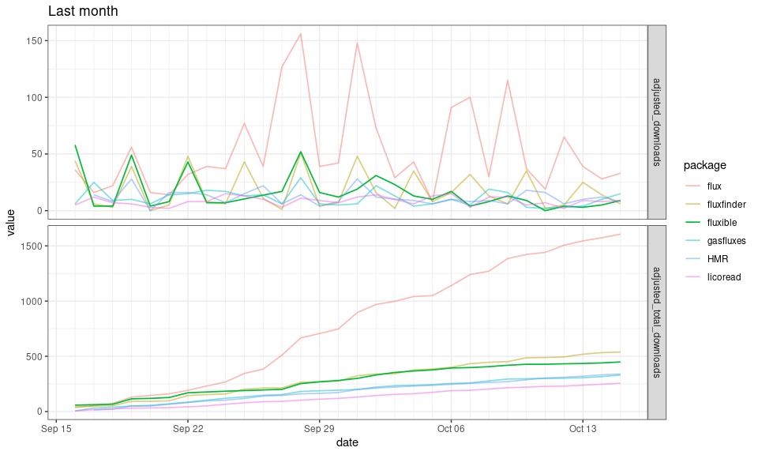
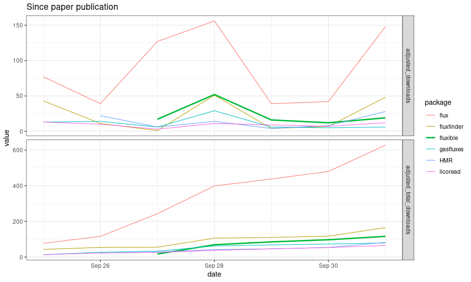
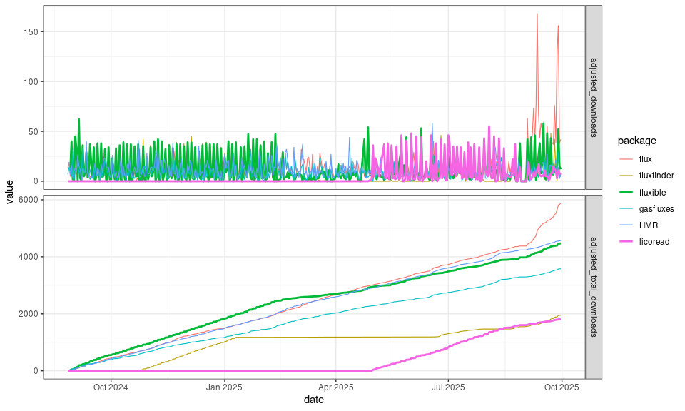

# fluxible download logs
Joseph Gaudard
2025-10-03

Figure 1: Number of downloads for the last month.

Figure 2: Number of downloads since paper was published.

Figure 3: Overall number of downloads since first CRAN acceptance.

