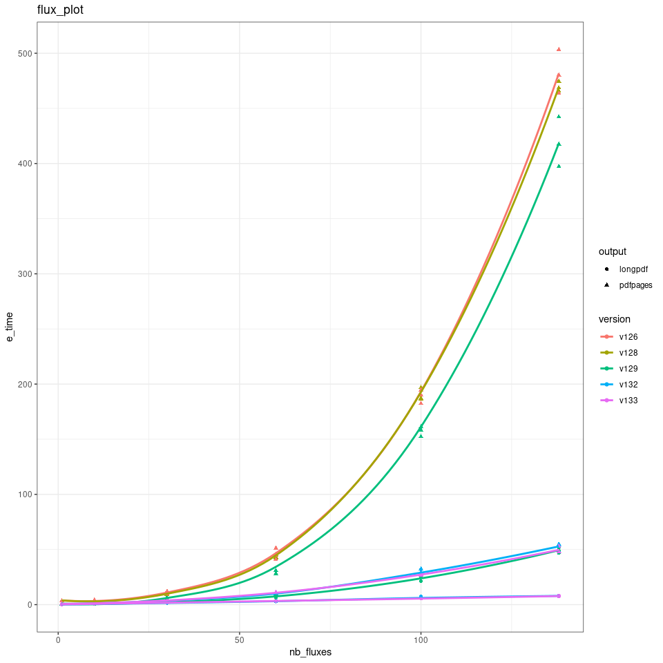
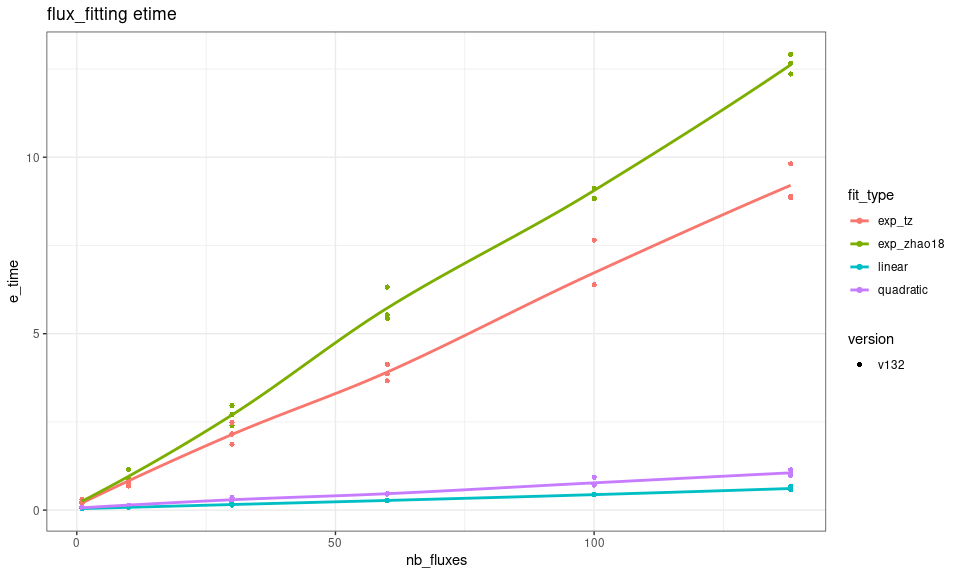

# fluxible performance report
Joseph Gaudard
2025-10-03

Current `fluxible` package version: 1.3.3

# `flux_plot`

``` r
plotting_etime <- function(version, nb_fluxes = c(1, 10, 30, 60, 100, 138),
 replicates = 3, output = c("pdfpages", "longpdf")) {

result <- replicate(n = replicates, expr = {
  map(nb_fluxes, \(x) {
test_df <- flags_liahovden |>
  filter(
    f_fluxid %in% sample(c(1:138), x)
  )
map(output, \(f) {
time <- system.time(
    {
        test_df |>
flux_plot(
  f_conc = conc,
  f_datetime = datetime,
  f_ylim_upper = 600, # upper limit of y-axis
  f_ylim_lower = 350, # lower limit of x-axis
  y_text_position = 450, # position of text with flags and diagnostics
  output = f,
  f_plotname = "test"
)
})

tibble(e_time = time["elapsed"], output = f)
}) |>
list_rbind() |>
  mutate(
    nb_fluxes = x
  )
}) |>
list_rbind()
}, simplify = FALSE) |>
list_rbind() |>
mutate(
  version = version
)

result
}
```

<div id="fig-flux_plot">



Figure 1: Performance of flux_plot per version and output.

</div>

# `flux_fitting`

``` r
fitting_etime <- function(version, nb_fluxes = c(1, 10, 30, 60, 100, 138),
 replicates = 3, fit_type = c("exp_zhao18", "linear", "quadratic", "exp_tz")) {


result <- replicate(n = replicates, expr = {
  map(nb_fluxes, \(x) {
test_df <- conc_liahovden |>
  filter(
    f_fluxid %in% sample(c(1:138), x)
  )

map(fit_type, \(f) {
  time <- system.time(
    {
        test_df |>
flux_fitting(
  f_conc = conc, # gas concentration column
  f_datetime = datetime, # date and time column
  fit_type = f, # the model to fit to the gas concentration
)
})

tibble(e_time = time["elapsed"], fit_type = f)


}) |>
list_rbind() |>
  mutate(
    nb_fluxes = x
  )
}) |>
list_rbind()
}, simplify = FALSE) |>
list_rbind() |>
mutate(
  version = version
)


result
}
```

<div id="fig-flux_fitting">



Figure 2: Performance of flux_fitting per version and model.

</div>
